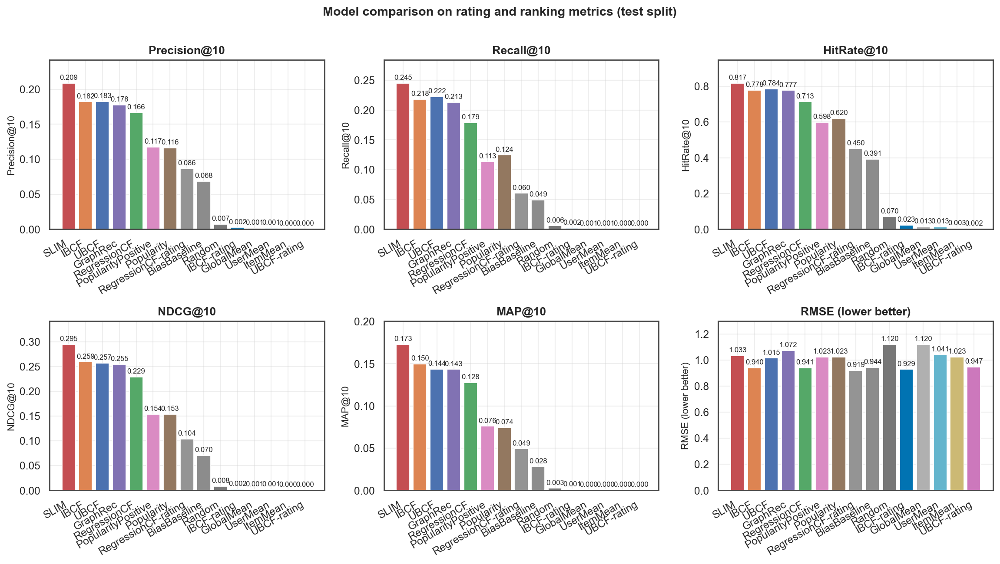
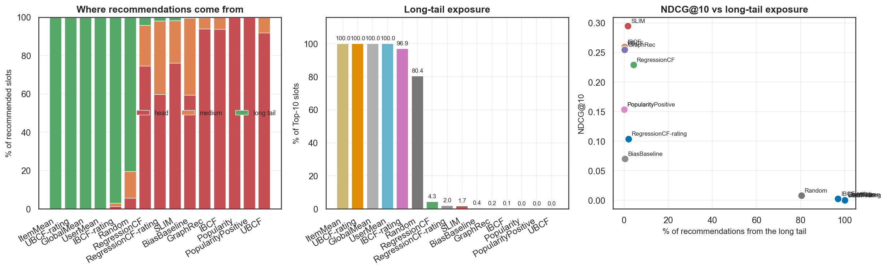
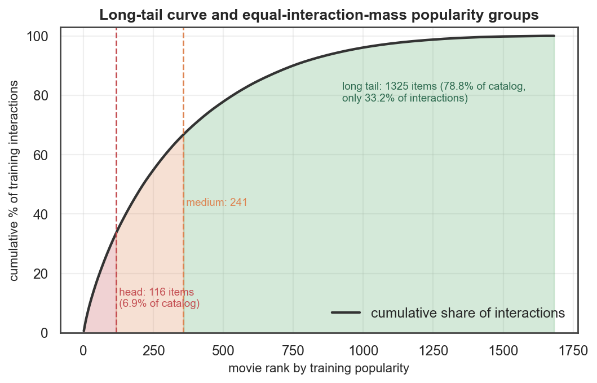

# MovieLens 100K — Five Recommendation Paradigms, Built From Scratch

An applied-research study comparing **user-based CF, item-based CF, regression-based neighbourhood CF, SLIM and graph propagation** on MovieLens 100K — every algorithm implemented directly in NumPy/SciPy, with **no recommender-system library** (no Surprise, LightFM, implicit, LensKit or RecBole).

The study measures all five on rating accuracy, ranking quality, catalogue coverage, novelty, diversity, popularity bias, long-tail exposure, cold-start behaviour and computational cost — then asks whether the most accurate model is actually the most useful one. The measured answer is more interesting than the expected one: on four objectives at once the Pareto front is **RegressionCF and SLIM**, the accuracy winner is on it, and the popularity bias everyone worries about turns out to belong to collaborative filtering as a class rather than to the accurate model.

---

## Headline results (held-out test split)

| Model | RMSE | MAE | P@10 | R@10 | HR@10 | NDCG@10 | MAP@10 | Coverage | Novelty | Diversity | LongTail | Train s |
|---|---|---|---|---|---|---|---|---|---|---|---|---|
| UBCF | 1.0151 | 0.8067 | 0.1825 | 0.2225 | 0.7845 | 0.2570 | 0.1436 | 0.0803 | 2.0203 | 0.6996 | 0.0000 | 0.0505 |
| IBCF | 0.9402 | 0.7380 | 0.1822 | 0.2181 | 0.7780 | 0.2593 | 0.1496 | 0.1130 | 2.0234 | 0.7231 | 0.0014 | 0.0880 |
| RegressionCF | 0.9408 | 0.7458 | 0.1663 | 0.1788 | 0.7134 | 0.2290 | 0.1275 | 0.2194 | 2.4085 | 0.6929 | 0.0428 | 0.1167 |
| SLIM | 1.0331 | 0.8327 | 0.2085 | 0.2450 | 0.8168 | 0.2950 | 0.1729 | 0.2063 | 2.2827 | 0.7067 | 0.0168 | 22.0045 |
| GraphRec | 1.0725 | 0.8698 | 0.1777 | 0.2131 | 0.7769 | 0.2546 | 0.1432 | 0.0797 | 1.8403 | 0.7104 | 0.0021 | 0.1199 |

Reference points:

| Model | RMSE | MAE | P@10 | R@10 | HR@10 | NDCG@10 | MAP@10 | Coverage | Novelty | Diversity | LongTail | Train s |
|---|---|---|---|---|---|---|---|---|---|---|---|---|
| Popularity | 1.0231 | 0.8153 | 0.1163 | 0.1244 | 0.6196 | 0.1535 | 0.0743 | 0.0238 | 1.5650 | 0.7619 | 0.0000 | 0.0004 |
| BiasBaseline | 0.9438 | 0.7485 | 0.0683 | 0.0490 | 0.3912 | 0.0704 | 0.0280 | 0.0184 | 2.6428 | 0.7340 | 0.0037 | 0.0197 |
| Random | 1.1203 | 0.9404 | 0.0072 | 0.0059 | 0.0700 | 0.0079 | 0.0025 | 0.9946 | 5.8258 | 0.7653 | 0.8036 | 0.0061 |

- Best ranker: **SLIM**, NDCG@10 0.2950 — 92.2% above a non-personalised popularity ranker (0.1535).
- Best rating predictor: **RegressionCF-rating**, RMSE 0.9191 vs 0.9438 for a regularised bias baseline — and it ranks at NDCG@10 0.1039, which is the point: the RMSE-optimal configuration is not the one you would ship.
- Widest catalogue reach: **RegressionCF**, 21.9% of the catalogue vs 20.6% for the accuracy winner — a gap of only 1.3 points, bought with 22.4% of the NDCG@10.
- Cheapest to train: **UBCF**, 0.051 s; most expensive: SLIM, 22.0 s.





## Executive summary

MovieLens 100K (943 users x 1682 movies, 100,000 ratings, 93.70% sparse) was split per user into 71/10/20 train/validation/test. Every hyper-parameter — neighbourhood size, similarity, centring, ranking head, ridge strength, elastic-net mix, implicit threshold, restart probability, propagation depth — was selected on validation across 457 measured configurations; the test split was read exactly once.

**The paradigms win on different axes, but not in the way the textbook says.** On four objectives at once — NDCG@10, catalogue coverage, novelty and long-tail share — the Pareto front is just **RegressionCF and SLIM**; SLIM strictly dominates UBCF, IBCF and the graph model on all four simultaneously, so accuracy does not *cause* popularity bias here. The genuine trade-off is between the two models on the front: RegressionCF buys 1.3 points of coverage and 2.6 points of long-tail exposure for 22.4% of NDCG@10 — a trade that is available but poor value at this operating point, which is itself the finding: on this data there is no cheap way to buy reach from the model alone.

**What every model shares is the exposure gap.** The 116 head movies are 6.9% of the catalogue and take 74.7-93.9% of all recommendation slots; the 1325 long-tail movies are 78.8% of the catalogue and take 0.0-4.3%. Popularity bias here is a property of collaborative filtering as a class, not of one model.

**Three results worth pulling out.** (1) Learning neighbourhood weights by ridge regression beats using similarity as the weight (0.9180 vs 0.9212 validation RMSE) — but the unregularised version is worse than every baseline, so the win comes from the shrinkage, not from the learning. (2) SLIM's learned matrix is 93.9% sparse (102 neighbours per item) and is certified optimal by a KKT residual of 9.7e-05, not merely by a stalled objective. (3) For the graph model, corr(propagation depth, head-item share) = 0.717 — deeper propagation is measurably a popularity dial, which follows from the stationary distribution of a walk on an undirected graph being proportional to degree.

## What is implemented (and how)

| Paradigm | Core mathematics | Implementation note |
|---|---|---|
| **UBCF** | `rhat = mu_u + Σ s(u,v)(r_vi - mu_v) / Σ|s|` | exact per-(u,i) neighbourhood; cosine and **exact co-rated Pearson computed as five sparse GEMMs** rather than a pairwise loop |
| **IBCF** | same, transposed | cosine / adjusted cosine / Pearson, item- or user-centred |
| **RegressionCF** | `(Z'Z + λI)w = Z'y` per item | ridge normal equations solved exactly; weights assembled into a sparse `W` so prediction is one sparse product |
| **SLIM** | `min ½‖X-XW‖² + λ₁‖W‖₁ + ½λ₂‖W‖²`, `W ≥ 0`, `diag(W)=0` | **projected FISTA written from scratch**, Lipschitz step from power iteration, convergence certified by KKT residual |
| **GraphRec** | `p ← (1-α)pP + αe` and `Σ_l β^l (A^l)_{ui}` | bipartite user-movie graph; probability mass conserved to 1e-12; degree-normalised and raw variants |

Every model also implements `explain(u, i)`, returning the evidence its own scoring rule actually used — neighbours, similar items, learned coefficients, or propagation paths.

## Quickstart

```bash
pip install -r requirements.txt

# fetch MovieLens 100K and verify it against the published MD5
python download_data.py

# full pipeline: EDA -> sweeps -> test evaluation -> analyses -> figures -> report
python run_experiments.py

# or a single stage
python experiments/exp06_slim.py

# interactive demo
streamlit run app/streamlit_app.py
```

**The dataset is not in this repository.** GroupLens' usage licence states that "the user may not redistribute the data without separate permission", so `download_data.py` fetches `ml-100k.zip` and refuses to extract anything whose MD5 is not the published `0e33842e24a9c977be4e0107933c0723`. (GroupLens' own HTTPS certificate is currently expired, so the script tries the official host first and falls back to mirrors — it never disables certificate verification, and the checksum is what establishes authenticity either way.)

Everything is seeded from the roll number, so `run_experiments.py` reproduces every number in `REPORT.md` exactly — the report is *generated* from `results/`, not written alongside it.

Most stages finish in seconds. The SLIM regularisation study is the expensive one: 31 separate solver runs, each driven to a KKT residual rather than to a fixed iteration count. The per-fit times recorded in `results/tables/slim_sweep.csv` span 14.3-171.6 s, but they were measured on a machine running other work, so treat them as an upper bound rather than a benchmark; budget roughly 10-25 minutes for that stage and a couple of minutes for everything else.

## Repository layout

```
download_data.py   fetches + MD5-verifies MovieLens 100K into data/
run_experiments.py runs every stage in dependency order
src/               data · similarity · metrics · baselines · ubcf · ibcf
                   regression_cf · slim · graph_recommender · evaluation
                   analysis · visualization · report · pipeline · base · config
experiments/       17 numbered stages, each runnable on its own
results/           JSON summaries + the evaluation tables REPORT.md is built from
figures/           17 report figures
app/               Streamlit demo over a headless service layer
notebooks/         a runnable walkthrough of the results
REPORT.md          the full research report (generated from results/)
PORTFOLIO.md       technical interview questions and answers
```

Two directories are deliberately not version-controlled, because both are large and regenerable: `data/` (see the licence note above) and `results/artifacts/` (pickled fitted models and saved Top-K lists, written by stage 16). The demo app refits from the stored configurations when that cache is absent, so a fresh clone needs only `download_data.py` and `run_experiments.py`.

## Target-user experiment

The target user is derived deterministically from the roll number:

```
roll = 23IM10049  ->  digits = 2310049  ->  2310049 mod 943 = 642  ->  +1  ->  user 643
SEED = 2310049 mod (2^31 - 1) = 2310049
```

30% of that user's training ratings are hidden (44 of 145), all five models are refitted on the reduced matrix, and their Top-10s are compared side by side:

| Model | Rank 1 | Rank 2 | Rank 3 | Rank 4 | Rank 5 | Rank 6 | Rank 7 | Rank 8 | Rank 9 | Rank 10 |
|---|---|---|---|---|---|---|---|---|---|---|
| UBCF | Silence of the Lambs, The (1991) | Shawshank Redemption, The (1994) | Schindler's List (1993) | Princess Bride, The (1987) | Pulp Fiction (1994) | Empire Strikes Back, The (1980) | Monty Python and the Holy Grail (1974) | Blade Runner (1982) | Terminator 2: Judgment Day (1991) | Alien (1979) |
| IBCF | Fugitive, The (1993) | Silence of the Lambs, The (1991) | Pulp Fiction (1994) | Empire Strikes Back, The (1980) | Princess Bride, The (1987) | Indiana Jones and the Last Crusade (1989) | Monty Python and the Holy Grail (1974) | Alien (1979) | Blade Runner (1982) | When Harry Met Sally... (1989) |
| RegressionCF | Empire Strikes Back, The (1980) | 2001: A Space Odyssey (1968) | Apocalypse Now (1979) | Psycho (1960) | Alien (1979) | Fish Called Wanda, A (1988) | Indiana Jones and the Last Crusade (1989) | Willy Wonka and the Chocolate Factory (1971) | Terminator 2: Judgment Day (1991) | Mighty Aphrodite (1995) |
| SLIM | Psycho (1960) | Pulp Fiction (1994) | Silence of the Lambs, The (1991) | GoodFellas (1990) | Sting, The (1973) | Terminator 2: Judgment Day (1991) | Forrest Gump (1994) | Apocalypse Now (1979) | Godfather: Part II, The (1974) | Twelve Monkeys (1995) |
| GraphRec | Silence of the Lambs, The (1991) | Pulp Fiction (1994) | Schindler's List (1993) | Empire Strikes Back, The (1980) | Fugitive, The (1993) | Princess Bride, The (1987) | Twelve Monkeys (1995) | Shawshank Redemption, The (1994) | Contact (1997) | Monty Python and the Holy Grail (1974) |

Per-movie, per-model reasoning is in `results/tables/target_reasoning.csv`; the narrated disagreements are in [REPORT.md](REPORT.md#18-target-user-recommendations).

## Popularity groups

Head / medium / long tail are defined by **equal interaction mass**, not an arbitrary rating-count cutoff: items are sorted by training popularity and the cumulative interaction curve is cut at 1/3 and 2/3. The result — 116 head movies (6.9% of the catalogue) absorbing a third of all attention, against 1325 long-tail movies (78.8%) sharing another third — is the fact every later analysis turns on.



## CV description

- Implemented **five recommendation paradigms from scratch** on MovieLens 100K (943x1682, 100,000 ratings, 93.7% sparse) with no recommender library — user-based and item-based CF (including exact co-rated Pearson as five sparse GEMMs), a regression-based neighbourhood model solved by per-item ridge normal equations, a SLIM-style non-negative elastic-net item-item model trained by a hand-written projected FISTA solver certified by its KKT residual (1e-04), and random-walk-with-restart / bounded-path propagation on the user-movie bipartite graph.
- Benchmarked all five over **457 validation-selected configurations** and a single-use test split: best NDCG@10 0.2950 (SLIM) versus 0.1535 for a popularity baseline, best RMSE 0.9402 (IBCF) versus 0.9438 for a regularised bias baseline, with catalogue coverage spanning 8.0%-21.9% and training cost 0.05s-22.0s.
- Ran **ablation, cold-start and popularity-bias analyses**: a four-objective Pareto analysis reduced the five paradigms to a two-model front (RegressionCF and SLIM) and showed every model draws 74.7-93.9% of recommendation slots from the 6.9% of the catalogue that is 'head'; established that regularisation — not learning per se — is what makes learned neighbourhood weights beat similarity heuristics; and showed graph propagation depth is a measurable popularity dial (corr 0.72 with head-item share). Shipped a Streamlit demo with per-recommendation explanations.

## 30-second interview explanation

> I built five recommender paradigms from scratch on MovieLens 100K — no Surprise, no LightFM — so user-based and item-based CF, a regression model that *learns* the neighbourhood weights instead of assuming similarity is the weight, SLIM with my own projected FISTA solver, and random-walk propagation on the user-movie graph. SLIM wins ranking with NDCG@10 0.2950, against 0.1535 for just recommending popular movies. But the result I actually care about came from scoring all five on four objectives at once — accuracy, catalogue coverage, novelty and long-tail share. The Pareto front is only two models, and the accuracy winner is on it: it beats UBCF, IBCF and the graph model on *all four* simultaneously. So the usual story that the accurate model is the biased one is just false on this data. What is true is that every one of them draws 74.7 to 93.9 percent of its slots from the 6.9 percent of the catalogue that's already popular. Popularity bias here is a property of collaborative filtering as a class, not of one model — which changes what you'd do about it: you don't pick a different model, you buy an explicit exploration budget.

Full write-up: **[REPORT.md](REPORT.md)** (22 sections). Interview preparation — technical questions and answers: **[PORTFOLIO.md](PORTFOLIO.md)**.

---

*Dataset: F. M. Harper and J. A. Konstan, "The MovieLens Datasets: History and Context", ACM TiiS 5(4), 2015. Used for research/educational purposes under the GroupLens terms.*
