# Comparative Study of Five Recommendation Paradigms on MovieLens 100K

*All algorithms implemented from scratch in NumPy/SciPy. Roll number `23IM10049` -> target user **643**. Master seed `2310049`.*

> Every number in this report is generated directly from `results/` by `src/report.py`. No figure is transcribed by hand.

---

## 1. Abstract

We implement and compare five recommendation paradigms on MovieLens 100K (943 users, 1682 movies, 100,000 ratings, 93.70% sparse) without using any recommender-system library: user-based collaborative filtering, item-based collaborative filtering, a regression-based neighbourhood model with learned interpolation weights, a SLIM-style sparse linear item-item model trained by projected FISTA under non-negativity and elastic-net regularisation, and two graph propagation methods (random walk with restart, and bounded-length path proximity) on the user-movie bipartite graph. Hyper-parameters are selected on a validation split and the test split is consumed exactly once.

On the held-out test split the strongest ranking model is **SLIM** (NDCG@10 = 0.2950, Recall@10 = 0.2450), against 0.1535 for a non-personalised popularity ranker. The strongest rating predictor over all measured configurations is **RegressionCF-rating** (RMSE = 0.9191, MAE = 0.7246) against 0.9438 for a regularised bias baseline; among the ranking-selected configurations the best is IBCF at 0.9402. Rating accuracy and ranking quality are held by different models and, as Section 13 shows, pursuing one to its optimum actively destroys the other: RegressionCF-rating reaches NDCG@10 0.1039 while SLIM reaches RMSE 1.0331.

The beyond-accuracy picture is sharper than a simple accuracy-versus-coverage trade-off. On the four objectives (NDCG@10, catalogue coverage, novelty, long-tail share) only **RegressionCF and SLIM** are Pareto-optimal; SLIM strictly dominates UBCF, IBCF, GraphRec on all four at once. The real cost is visible elsewhere: the 116 head movies are 6.9% of the catalogue but take 74.7-93.9% of every model's recommendation slots, while the 1325 long-tail movies (78.8% of the catalogue) take 0.0-4.3%. We quantify this across popularity strata, user-history strata and computational cost, and show for the graph model that increasing propagation depth provably and measurably drifts recommendations toward popularity.

## 2. Problem statement

Given a partially observed user-item rating matrix *R*, produce for each user a ranked list of unseen items. The project asks two questions that are usually conflated:

1. **Rating prediction** -- estimate `r_ui` for held-out cells, measured by RMSE/MAE.
2. **Top-N recommendation** -- order the unseen catalogue, measured by Precision/Recall/HitRate/NDCG/MAP@10.

A recommender is only useful if it also *reaches* the catalogue, so we add catalogue coverage, novelty, intra-list diversity and long-tail exposure as first-class objectives rather than as afterthoughts, and we measure the computational cost of each paradigm.

The constraint that shapes every implementation decision here is that no recommender library may be used: similarities, neighbourhood aggregation, ridge normal equations, the elastic-net solver and the graph propagation are all written directly in terms of sparse matrix algebra.

## 3. Dataset

MovieLens 100K, verified against the published archive MD5 `0e33842e24a9c977be4e0107933c0723`.

| Property | Value |
|---|---|
| Users | 943 |
| Movies | 1,682 |
| Ratings | 100,000 |
| Rating scale | 1 - 5 (5 integer levels) |
| Mean rating | 3.530 |
| Std of ratings | 1.126 |
| Matrix shape | 943 x 1682 = 1,586,126 cells |
| Observed entries | 100,000 |
| Density | 6.3047% |
| Sparsity | 93.6953% |
| Avg ratings / user | 106.04 |
| Median ratings / user | 65.0 |
| Min / max ratings per user | 20 / 737 |
| Avg ratings / movie | 59.45 |
| Median ratings / movie | 27.0 |
| Min / max ratings per movie | 1 / 583 |

Every user has at least 20 ratings by dataset construction, so there are no strictly cold users; the sparsity problem here is on the item side, where the median movie has only 27 ratings.

## 4. Exploratory analysis

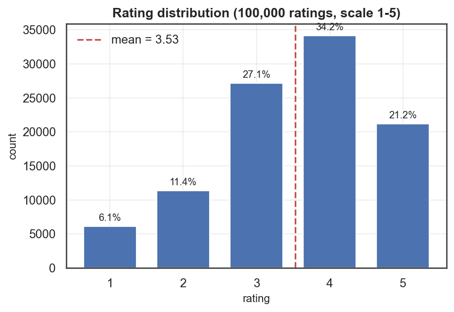

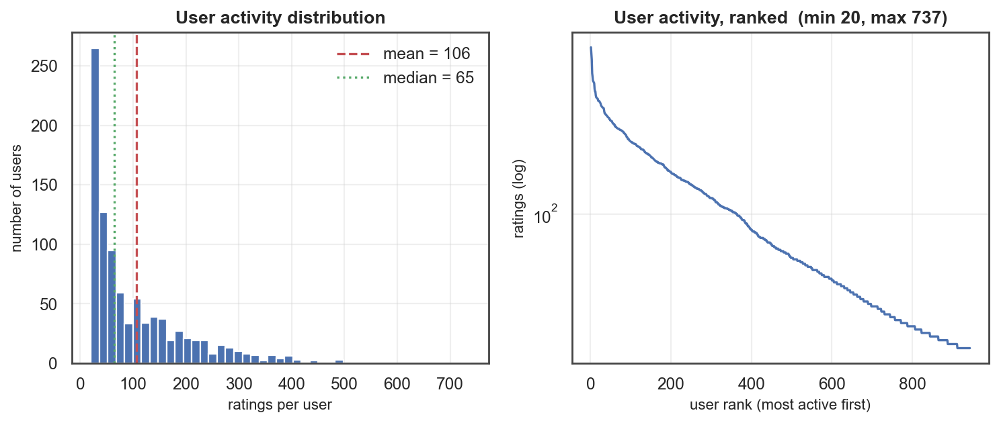

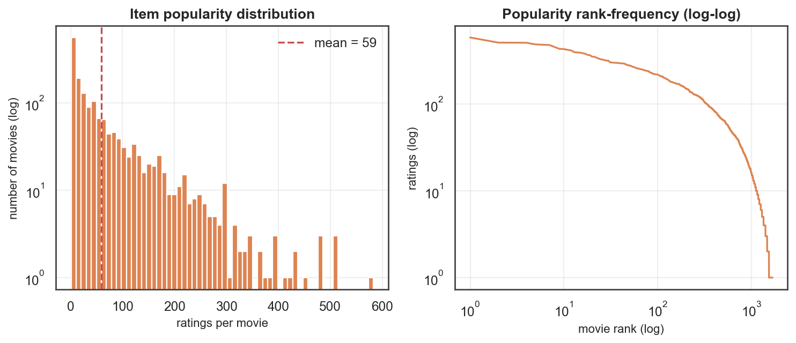


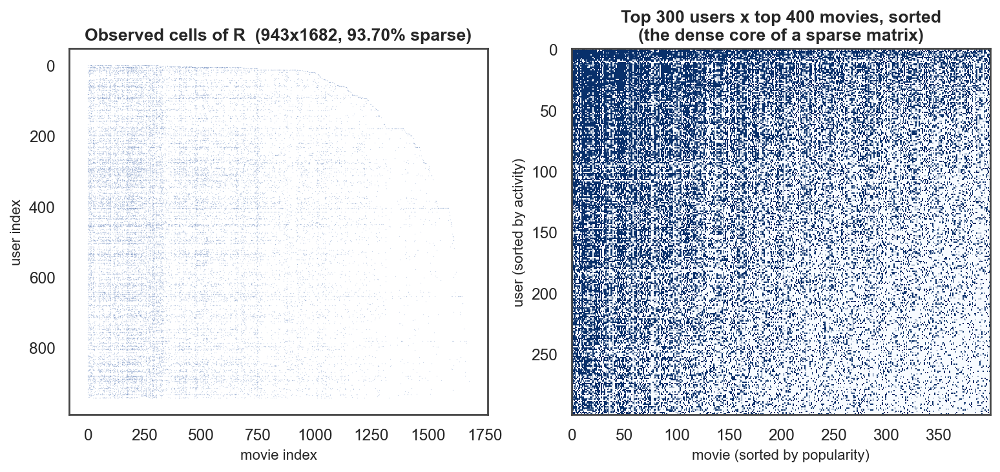

The rating distribution is strongly left-skewed (mean 3.530 on a 1-5 scale): users mostly rate films they chose to watch, so 4 is the modal rating. This matters for the implicit-feedback conversion in Part F -- 'rated' and 'liked' are not the same event, and the threshold that separates them has to be measured, not assumed.

### Popularity groups

Items are sorted by descending TRAIN interaction count and the cumulative interaction curve is cut at 1/3 and 2/3 of total interaction mass. Each group therefore absorbs the same share of observed attention, which makes the partition scale-free and exposure-weighted rather than dependent on an arbitrary rating-count constant.

| Group | Movies | % of catalog | Threshold | Interaction mass |
|---|---|---|---|---|
| Head | 116 | 6.9% | >= 143 train ratings | ~33% of interactions |
| Medium | 241 | 14.3% | >= 66 train ratings | ~33% of interactions |
| Long tail | 1325 | 78.8% | < 66 train ratings | ~33% of interactions |

The asymmetry is the headline fact of the dataset: 116 movies (6.9% of the catalogue) absorb a third of all attention, while 1325 movies (78.8%) share another third between them. Any model that optimises accuracy alone will gravitate to the first group, and Part J measures exactly how far each one does.

## 5. Methodology

### 5.1 Notation

`R` is the user-item rating matrix; `I_u` the items rated by user *u*; `U_i` the users who rated item *i*; `mu`, `mu_u`, `mu_i` the global, user and item means; `s(a,b)` a similarity; `N_k(.)` a k-nearest-neighbourhood; `X` the binary implicit matrix; `G = X^T X` its Gram matrix.

### 5.2 Similarities (exact, via sparse GEMMs)

```
cos(a,b) = <r_a, r_b> / (||r_a|| ||r_b||)

                     n*S_ab - S_a*S_b
pearson(a,b) = ------------------------------------ ,  all sums over I_a ∩ I_b
               sqrt(n*Q_a - S_a^2) sqrt(n*Q_b - S_b^2)
```

Co-rated Pearson is usually written as a pairwise loop. It is not needed: with `B` the binary indicator of `R`, multiplying by `B` restricts a sum to the co-rated set, so `n = B B^T`, `S_a = R B^T`, `S_ab = R R^T`, `Q_a = R² B^T`. Five sparse matrix products give the exact co-rated correlation for all pairs (verified against a brute-force implementation to 0.0 absolute error).

Two reliability corrections are applied to every similarity: pairs with fewer than `min_support = 3` co-ratings are zeroed, and the rest are shrunk by significance weighting `s' = s * min(n, 25) / 25`.

### 5.3 Ranking heads

Ranking a candidate set by predicted rating is fragile: an item supported by one enthusiastic neighbour can reach `rhat = 5.0` on almost no evidence. Each neighbourhood model therefore exposes three ranking heads and the choice is made on the **validation** split:

- `rating` -- rank by `rhat_ui`;
- `score` -- rank by the *unnormalised* similarity-weighted deviation sum (evidence mass stays in the numerator);
- `affinity` -- rank by `sum_{v} max(s,0) * 1[r_vi >= tau]`, the implicit-feedback objective that matches the Top-N task.

### 5.4 Splitting and leakage control

Per-user stratified random split: within each user's ratings, 20% go to test and 10% to validation, the rest to train, with every user guaranteed at least one training rating.

1) Models are fitted on R_train alone -- every similarity, bias, learned weight, Gram matrix and graph edge is derived from train. 2) Top-N candidate sets exclude only TRAIN-rated items; excluding test items would reveal which items are held out. 3) Hyper-parameters (k, lambda, ranking head, restart strength) are chosen on the validation split; the test split is consumed once, at reporting time. 4) Popularity groups, novelty weights and user-history tertiles are all computed from train counts, so even the analysis strata are leakage-free.

Resulting sizes: train 70,771 (70.8%), validation 9,596 (9.6%), test 19,633 (19.6%). A held-out rating counts as a true positive when it is >= 4; 928 of 943 users have at least one, and per-user ranking metrics are averaged over those users.

### 5.5 Target-user selection from the roll number

```
roll                 = 23IM10049
digits(roll)         = 2310049  -> 2310049
2310049 mod 943        = 642
target_user_id       = 642 + 1 = 643
SEED                 = 2310049 mod (2^31 - 1) = 2310049
```

The `+1` shifts the 0-based residue into MovieLens' 1-based user ids; the modulo makes the map total for any roll number. The master seed is derived from the same digits, so a different roll number yields a different but equally reproducible experiment. User 643 has 206 ratings in total; 44 of the 145 training ratings are hidden (30%), leaving a visible profile of 101, plus 41 globally held-out ratings.

## 6. Baselines

Absolute error numbers are uninterpretable without a reference. Predicting each user's own mean already reaches RMSE 1.0412 and the regularised bias model reaches 0.9438; any collaborative model must be judged against that, not against zero. On the ranking side the asymmetry is even sharper: non-personalised popularity reaches NDCG@10 = 0.1535 versus 0.0079 for random, so a personalised model that scores 0.15 has added exactly nothing while paying for a similarity matrix.

| Model | RMSE | MAE | P@10 | R@10 | HR@10 | NDCG@10 | MAP@10 | Coverage |
|---|---|---|---|---|---|---|---|---|
| Random | 1.1203 | 0.9404 | 0.0072 | 0.0059 | 0.0700 | 0.0079 | 0.0025 | 0.9946 |
| GlobalMean | 1.1203 | 0.9404 | 0.0014 | 0.0006 | 0.0129 | 0.0015 | 0.0005 | 0.1112 |
| UserMean | 1.0412 | 0.8339 | 0.0014 | 0.0006 | 0.0129 | 0.0015 | 0.0005 | 0.1112 |
| ItemMean | 1.0231 | 0.8153 | 0.0003 | 0.0002 | 0.0032 | 0.0003 | 0.0001 | 0.0071 |
| BiasBaseline | 0.9438 | 0.7485 | 0.0683 | 0.0490 | 0.3912 | 0.0704 | 0.0280 | 0.0184 |
| Popularity | 1.0231 | 0.8153 | 0.1163 | 0.1244 | 0.6196 | 0.1535 | 0.0743 | 0.0238 |
| PopularityPositive | 1.0231 | 0.8153 | 0.1173 | 0.1129 | 0.5981 | 0.1536 | 0.0759 | 0.0232 |

Sanity checks all hold: user-mean beats global-mean on RMSE (`True`), item-mean beats global-mean (`True`), the regularised bias model beats both (`True`), and popularity beats random on NDCG@10 (`True`).

The important baseline is popularity, not the mean predictors. Recommending the most-rated movies to everybody reaches NDCG@10 = 0.1535 with zero personalisation, which is 19.4x the random floor. Any personalised model below that line is not earning its complexity.

## 7. User-based collaborative filtering

```
                 sum_{v in N_k(u,i)} s(u,v) (r_vi - mu_v)
rhat_ui = mu_u + -----------------------------------------
                      sum_{v in N_k(u,i)} |s(u,v)|
```

`N_k(u,i)` is the *exact* per-(u,i) neighbourhood: the k users most similar to u **among those who actually rated i**, recomputed for every item rather than approximated by intersecting a global top-k list. The cheaper approximation silently shrinks the effective k for unpopular items and makes k-curves look better than they are.

The sweep covers 2 similarities x 2 centring settings x 9 neighbourhood sizes x 3 ranking heads = 108 measured configurations, all on the validation split.

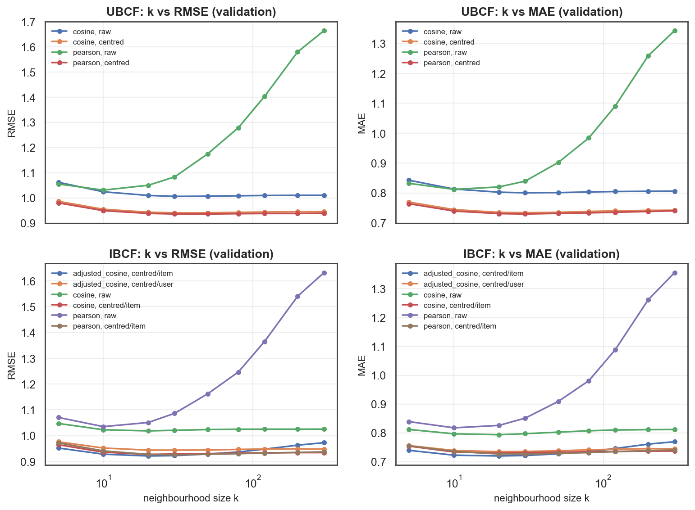

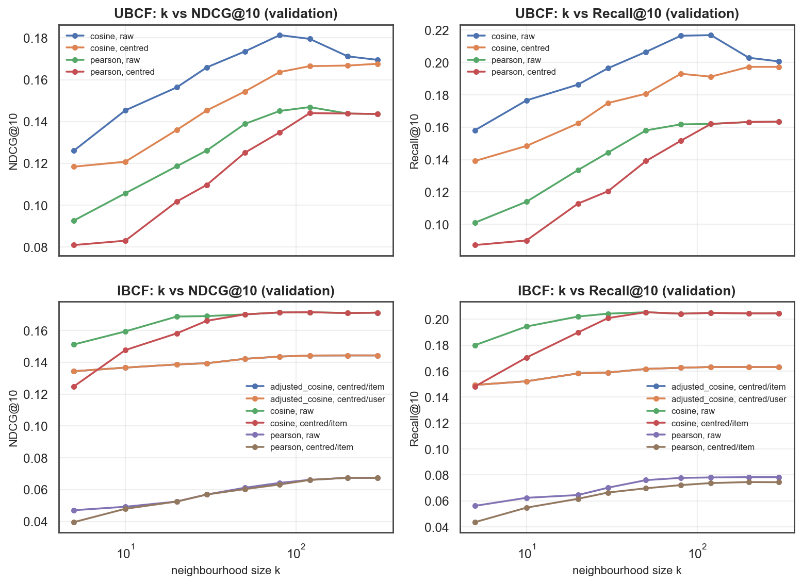

Selected on validation: ranking `{'family': 'ubcf', 'k': 80, 'similarity': 'cosine', 'mean_center': False, 'min_support': 3, 'beta': 25.0, 'rank_mode': 'score'}` (val NDCG@10 = 0.1813); rating `{'family': 'ubcf', 'k': 50, 'similarity': 'pearson', 'mean_center': True, 'min_support': 3, 'beta': 25.0, 'rank_mode': 'rating'}` (val RMSE = 0.9358).

**Findings (UBCF, validation split).**
- *Cosine vs Pearson.* Best RMSE: cosine 0.9404 vs Pearson 0.9358. Best NDCG@10: cosine 0.1813 vs Pearson 0.1469. The two similarities win on different objectives — Pearson removes rating scale and sharpens the rating head, cosine retains profile-overlap information that the Top-N head needs.
- *Mean-centring.* Best RMSE: centred 0.9358 vs raw 1.0059 (a 0.0701 improvement). Best NDCG@10: centred 0.1676 vs raw 0.1813. Centring is close to mandatory for rating prediction and roughly neutral-to-negative for ranking, because the centred numerator rewards items that sit above a neighbour's mean rather than items with a lot of supporting evidence.
- *Neighbourhood size.* RMSE is minimised at k = 50 and rises again beyond it (the classic U), while NDCG@10 keeps improving until k = 80 and then plateaus. Ranking wants more evidence than rating prediction does: extra weak neighbours add noise to a point estimate but stabilise an ordering.
- *Ranking head.* The validation-selected head is `score` (NDCG@10 0.1813); the `rating` head reaches only 0.0127, which is the quantitative form of the 'never rank by predicted rating' rule.

## 8. Item-based collaborative filtering

```
                 sum_{j in N_k(i,u)} s(i,j) (r_uj - mu_j)
rhat_ui = mu_i + -----------------------------------------
                      sum_{j in N_k(i,u)} |s(i,j)|
```

The sweep covers 6 similarity/centring regimes x 9 neighbourhood sizes x 3 ranking heads = 162 configurations.

Selected on validation: ranking `{'family': 'ibcf', 'k': 120, 'similarity': 'cosine', 'mean_center': True, 'center_by': 'item', 'min_support': 3, 'beta': 25.0, 'rank_mode': 'affinity'}` (val NDCG@10 = 0.1715); rating `{'family': 'ibcf', 'k': 20, 'similarity': 'adjusted_cosine', 'mean_center': True, 'center_by': 'item', 'min_support': 3, 'beta': 25.0, 'rank_mode': 'rating'}` (val RMSE = 0.9210).

**Findings (IBCF, validation split).**
- *Cosine vs Pearson.* Best RMSE: cosine 0.9272 vs Pearson 0.9256. Best NDCG@10: cosine 0.1715 vs Pearson 0.0674. The two similarities win on different objectives — Pearson removes rating scale and sharpens the rating head, cosine retains profile-overlap information that the Top-N head needs.
- *Mean-centring.* Best RMSE: centred 0.9210 vs raw 1.0184 (a 0.0973 improvement). Best NDCG@10: centred 0.1715 vs raw 0.1715. Centring is close to mandatory for rating prediction and roughly neutral-to-negative for ranking, because the centred numerator rewards items that sit above a neighbour's mean rather than items with a lot of supporting evidence.
- *Neighbourhood size.* RMSE is minimised at k = 20 and rises again beyond it (the classic U), while NDCG@10 keeps improving until k = 120 and then plateaus. Ranking wants more evidence than rating prediction does: extra weak neighbours add noise to a point estimate but stabilise an ordering.
- *Ranking head.* The validation-selected head is `affinity` (NDCG@10 0.1715); the `rating` head reaches only 0.0135, which is the quantitative form of the 'never rank by predicted rating' rule.

### Why UBCF and IBCF differ

On the test split IBCF reaches RMSE 0.9402 / NDCG@10 0.2593 against UBCF's 1.0151 / 0.2570. Three structural reasons:

1. **Estimation support.** A user profile here averages 106 ratings, but item-item co-rating counts concentrate on a popular core, so item similarities are estimated from far more co-observations than user similarities and are correspondingly less noisy.
2. **Stability.** Item-item relations are near-stationary while user tastes and the user set churn, which is why industrial systems standardised on item-item.
3. **Model size and cost.** The UBCF similarity matrix is 943² = 889,249 entries; IBCF's is 1682² = 2,829,124. Here IBCF is the more expensive of the two (22.7 MB vs 7.1 MB); in a catalogue with |U| >> |I| the ordering reverses, which is the usual real-world case.

They also behave differently on coverage: IBCF reaches 11.3% of the catalogue versus 8.0% for UBCF, because item neighbourhoods anchor on what the user already watched and can wander away from the global popularity core, whereas user neighbourhoods reconverge on whatever the similar users collectively watched -- which is the popular set.

## 9. Regression-based collaborative filtering

For a target item *i* with neighbourhood `N(i)`, every user who rated *i* becomes one training example:

```
target   y_u  = r_ui - b_ui
features z_uj = r_uj - b_uj   for j in N(i)   (0 when u never rated j)

min_w  sum_u ( y_u - sum_j w_ij z_uj )^2 + lambda ||w||^2
  =>   (Z^T Z + lambda I) w = Z^T y      (solved exactly, one k x k system per item)

rhat_ui = b_ui + sum_j w_ij (r_uj - b_uj)          b_ui = mu + b_u + b_i
```

Stacking the per-item solutions into a sparse matrix `W` turns prediction into a single sparse product `P = B + D W`, which makes this model directly comparable with SLIM's learned `W` and with the raw similarity matrix.

### Statistical interpretation

`s(i,j)` is a **marginal** association -- how *j* relates to *i* ignoring everything else. `w_ij` is a **partial** regression coefficient -- how *j* relates to *i* holding the other neighbours fixed. The measured consequences:

- Correlation between similarity and learned coefficient at the selected configuration: Pearson r = 0.617, Spearman rho = 0.719. They agree in *ordering* far more than in *magnitude*, which is exactly what you expect when redundancy among neighbours is being discounted.
- 5.5% of learned coefficients are negative, and 1.9% are outright sign flips (positive similarity, negative weight) -- classic suppressor effects that a similarity heuristic cannot express.
- Similarity weights are normalised to sum to 1 per item by construction; the learned weights sum to 0.805 on average, so the regression can say 'this neighbourhood barely determines the target' -- something the heuristic literally cannot do.

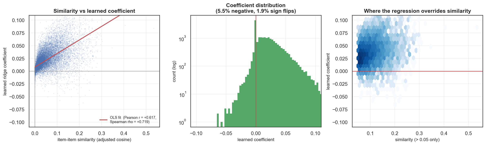

### Does learning the weights help?

| lambda | best val RMSE | best val NDCG@10 | mean r(sim,coef) |
|---|---|---|---|
| 0.0000 | 0.9975 | 0.0188 | 0.0058 |
| 1.0000 | 0.9592 | 0.0572 | 0.2112 |
| 5.0000 | 0.9425 | 0.0778 | 0.3310 |
| 25.0000 | 0.9244 | 0.1140 | 0.5092 |
| 100.0000 | 0.9180 | 0.1387 | 0.6435 |
| 300.0000 | 0.9232 | 0.1438 | 0.6951 |
| 1000.0000 | 0.9329 | 0.1479 | 0.7116 |
| 3000.0000 | 0.9383 | 0.1484 | 0.7141 |

Unregularised least squares fails, and it fails in the way the theory predicts -- it gets worse as the model gets bigger. At k = 40 it reaches validation RMSE 1.2077 against 0.9180 for the best ridge setting at the same k; across the k grid its RMSE runs k=10: 0.9975, k=20: 1.0775, k=40: 1.2077, k=80: 1.3651, so by k = 80 it is worse than predicting the global mean (1.1203). That is the signature of an under-determined system: k features against a design matrix whose row count is the number of users who rated the target item, which for most of the catalogue is smaller than k.

As lambda grows the coefficients shrink toward zero *and* toward the similarity ordering: `r(sim,coef)` rises monotonically along the table above, from 0.006 at lambda = 0 to 0.714 at lambda = 3000. That is the shrinkage-toward-the-prior story made visible: with no regularisation the learned weights carry no relationship to similarity at all, and with enough of it they converge back onto the heuristic they were supposed to improve. The useful setting is in between, and it has to be found by measurement.

At its best setting the learned model reaches validation RMSE 0.9180 against 0.9212 for the identical architecture with similarity weights: learned weights **do** help (`True`), but only once regularised. The gain is real and small; the interpretability gain is larger.

## 10. SLIM

```
min_W (1/2)||X - XW||_F^2 + lambda_1 ||W||_1 + (lambda_2/2) ||W||_F^2
s.t.  W >= 0 ,  diag(W) = 0
```

`diag(W) = 0` is essential -- otherwise `W = I` reconstructs `X` perfectly and learns nothing. `W >= 0` makes every coefficient an interpretable 'item j is evidence for item i' weight. L1 produces exact zeros; L2 keeps the problem strictly convex and stops near-duplicate items fighting over one coefficient.

### Solver

Projected FISTA, written from scratch. With `G = X^T X`, the gradient of the smooth part is `grad = G W - G + lambda_2 W`, so one dense GEMM per iteration solves all 1,682 column problems simultaneously. Because `W >= 0`, the L1 term is linear on the feasible set and its proximal operator collapses to a shifted projection `max(0, V - eta*lambda_1)` followed by zeroing the diagonal. Step size `eta = 1/L` with `L = lambda_max(G) + lambda_2` from power iteration; Nesterov momentum gives the O(1/t²) rate.

Convergence is certified by the KKT conditions rather than by a stalled objective: at the optimum `W_ij > 0 => grad_ij + lambda_1 = 0` and `W_ij = 0 => grad_ij + lambda_1 >= 0`. The delivered model stops at a relative KKT violation of 9.67e-05 (absolute 0.0350 on a Gram scale of 362) after 175 iterations.

### Implicit-feedback conversion

MovieLens is an explicit 1-5 dataset, but SLIM models item co-occurrence in *consumption* data, so the ratings must be reduced to a binary 'this user endorsed this item' signal. tau is not assumed: it is swept. tau=1 keeps every rating and therefore treats a 1-star review as an endorsement, which injects negative evidence as if it were positive. tau=5 is too strict and starves most items of support. The sweep in slim_sweep.csv (tag='threshold') reports NDCG@10, sparsity and catalogue coverage at every tau on the validation split, and the value recorded here is the measured argmax.

| tau | positives kept | val NDCG@10 | val coverage |
|---|---|---|---|
| 1.0000 | 70771 | 0.1869 | 0.2348 |
| 2.0000 | 66408 | 0.1971 | 0.2295 |
| 3.0000 | 58412 | 0.2058 | 0.2200 |
| 4.0000 | 39239 | 0.2081 | 0.2063 |
| 5.0000 | 15059 | 0.1552 | 0.2331 |

The measured optimum is **tau = 4**, which keeps 39,239 of 70,771 training ratings. Both directions degrade for the predicted reasons: tau=1 admits 1-star ratings as endorsements and pollutes the co-occurrence counts, tau=5 starves the Gram matrix of support.

### Sparsity and the regularisation trade-off

The delivered model has 171,388 non-zero coefficients out of 2,827,442 off-diagonal cells -- **93.938% sparse**, a mean of 101.9 learned neighbours per item (median 101, max 288), with 293 items receiving no incoming coefficient at all.

| lambda1 | lambda2 | sparsity % | nnz | val NDCG@10 | val coverage | fit s |
|---|---|---|---|---|---|---|
| 0.1000 | 50.0000 | 91.8108 | 231545 | 0.2071 | 0.2087 | 14.6380 |
| 0.2500 | 50.0000 | 92.5116 | 211729 | 0.2068 | 0.2105 | 20.8279 |
| 0.5000 | 50.0000 | 93.9384 | 171388 | 0.2081 | 0.2063 | 26.4217 |
| 1.0000 | 50.0000 | 96.9704 | 85661 | 0.2071 | 0.2021 | 56.9634 |
| 2.0000 | 50.0000 | 98.3053 | 47916 | 0.2069 | 0.1914 | 29.3699 |
| 5.0000 | 50.0000 | 99.2967 | 19884 | 0.2031 | 0.1730 | 45.9703 |
| 10.0000 | 50.0000 | 99.6748 | 9195 | 0.1946 | 0.1516 | 120.5602 |
| 20.0000 | 50.0000 | 99.8763 | 3497 | 0.1822 | 0.1219 | 44.1968 |
| 50.0000 | 50.0000 | 99.9830 | 480 | 0.1373 | 0.0731 | 41.9676 |

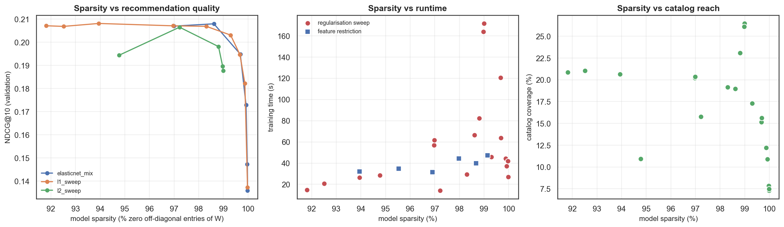

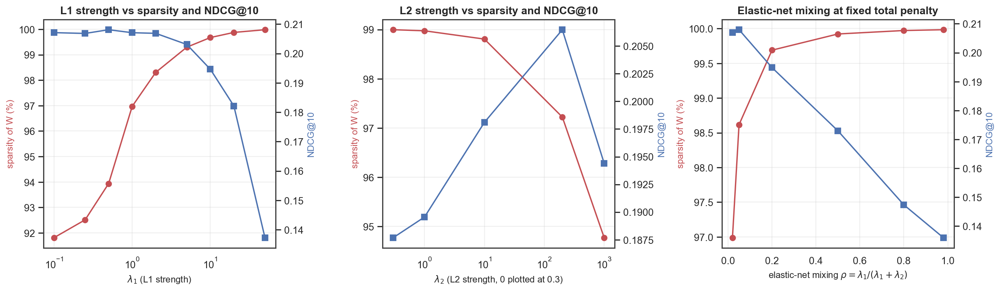

Across the regularisation grid, sparsity correlates -0.541 with NDCG@10 and -0.362 with catalogue coverage. The trade-off is therefore not 'sparser is cheaper but worse' in a vague sense -- it is specific: pruning edges removes the *weak* item-item links, and weak links are precisely what connect a user to the tail. A sparser SLIM is a smaller, faster model that recommends a smaller slice of the catalogue.

Correlation between sparsity and fit time is 0.391: heavier L1 also converges in fewer iterations, so on this problem sparsity is free at training time as well.

One negative result worth recording: restricting each column's candidate features to its top-M co-occurring items -- the standard way to scale SLIM -- made training **slower** here (31.6-47.2s versus 32.1s unrestricted) while costing NDCG@10. At 1,682 items the dense Gram GEMM already dominates and the masking is pure overhead; the technique only pays once the catalogue is large enough that the dense Gram no longer fits in memory.

Strongest learned item-item relationships:

| Evidence item j | Predicts item i | W[j,i] | pop(j) | pop(i) |
|---|---|---|---|---|
| Chasing Amy (1997) | Chasing Amy (1997) | 0.2066 | 82 | 186 |
| As Good As It Gets (1997) | Apt Pupil (1998) | 0.1925 | 75 | 120 |
| Grand Day Out, A (1992) | Wrong Trousers, The (1993) | 0.1919 | 47 | 90 |
| Return of the Jedi (1983) | Star Wars (1977) | 0.1842 | 370 | 421 |
| Grand Day Out, A (1992) | Close Shave, A (1995) | 0.1833 | 47 | 83 |
| Manon of the Spring (Manon des sources) (1986) | Jean de Florette (1986) | 0.1821 | 40 | 49 |
| Jean de Florette (1986) | Manon of the Spring (Manon des sources) (1986) | 0.1702 | 49 | 40 |
| Star Wars (1977) | Return of the Jedi (1983) | 0.1636 | 421 | 370 |

## 11. Network-based recommender

The user-movie graph is bipartite, so every user-to-item path has odd length and the shortest informative one has length 3:

```
u --rated--> i'  <--rated-- v --rated--> i
"people who liked what you liked also liked i"
```

**Bounded-length path proximity (Katz-style).** `score(u,i) = sum_{l odd <= L} beta^l (A^l)_{u,i}`, computed by repeated sparse products, never by forming `A^l`. `beta` is the attenuation: each extra hop discounts a walk geometrically. With `normalize='degree'` the adjacency is replaced by `D^-1 A`, so every node spreads a fixed unit of evidence instead of an amount proportional to its degree.

**Random walk with restart.** `p_{t+1} = (1-alpha) p_t P + alpha e_u`, power-iterated to the personalised PageRank fixed point. Probability stranded on dangling nodes is returned to the restart vector each step, so the iterate stays an exact distribution -- measured total mass stays within [1.000000000000, 1.000000000000] across every configuration.

Best RWR: alpha = 0.95 (val NDCG@10 0.1749). Best path model: L = 3, beta = 0.2, degree-normalised (val NDCG@10 0.1750).

### Does deeper propagation make recommendations more popular?

| path length L | val NDCG@10 | mean pop-rank | head share | long-tail share | novelty (bits) | coverage |
|---|---|---|---|---|---|---|
| 1 | 0.0011 | 0.6295 | 0.0000 | 0.9996 | 6.6490 | 0.1112 |
| 3 | 0.1750 | 0.0175 | 0.9393 | 0.0021 | 1.8403 | 0.0797 |
| 5 | 0.1694 | 0.0157 | 0.9492 | 0.0019 | 1.8091 | 0.0722 |
| 7 | 0.1667 | 0.0151 | 0.9535 | 0.0018 | 1.7971 | 0.0699 |
| 9 | 0.1654 | 0.0147 | 0.9553 | 0.0017 | 1.7918 | 0.0687 |

pop_rank is the mean normalised popularity rank of the Top-10 (0 = the single most-rated movie in the catalogue, 1 = the least). A NEGATIVE correlation between path length and pop_rank therefore means deeper propagation drifts toward MORE popular items, which is the predicted behaviour: as walks lengthen, the distribution over nodes converges to the degree-proportional stationary distribution, i.e. to raw popularity.

Measured: corr(depth, mean pop-rank) = -0.710, corr(depth, head share) = 0.717, corr(depth, novelty) = -0.713. This is not an artefact of the data: an undirected graph's stationary distribution is proportional to node degree, so 'propagate far enough' and 'recommend by popularity' are the same operator in the limit. The restart parameter shows the same physics from the other side: corr(alpha, mean pop-rank) = 0.973 and corr(alpha, novelty) = 0.973 -- restarting more often keeps the walk local and the recommendations novel.

## 12. Experimental setup

- Seed `2310049` (derived from the roll number), used for the split, the target-user holdout and every stochastic component.
- Per-user stratified split 71/10/20.
- K = 10; relevance threshold 4.
- Candidate set per user = all 1682 movies minus the user's *training* items.
- Novelty = mean self-information in bits; intra-list diversity = 1 - mean pairwise cosine over the 19 genre flags (a model-independent yardstick, deliberately not a CF similarity).
- All configuration selection on validation; the test split is read once.

Total measured configurations: 108 UBCF + 162 IBCF + 108 regression + 31 SLIM + 48 graph = 457.

### 12.1 Computational complexity and scalability

| Model | Training cost | Model memory | Measured (train / size) | Where it breaks |
|---|---|---|---|---|
| UBCF | 5 sparse GEMMs for the similarity; O(|U|·nnz) for the exact per-(u,i) top-k | O(|U|²) | 0.05 s / 7.1 MB | |U|² model: the dimension that grows fastest in a real system |
| IBCF | same, transposed | O(|I|²) | 0.09 s / 22.7 MB | |I|² model, but precomputable offline and stable between refreshes |
| RegressionCF | O(nnz·k² + |I|·k³) — one k x k solve per item | O(|I|·k) sparse W | 0.12 s / 1.74 MB | k³ per item is trivial for k<=80; the dense deviation matrix is the real limit |
| SLIM | one |I|³ dense GEMM per FISTA iteration | O(|I|²) Gram during training | 22.0 s / 2.06 MB | dense Gram is the wall: 22 MB here, ~80 GB at 10^5 items |
| GraphRec | O(|U|·nnz) per power-iteration step, sparse matvecs only | O(nnz) graph | 0.12 s / 13.16 MB | scales best in memory; per-user inference is the cost, not training |

Two deliberate algorithmic choices are worth calling out because the naive alternative is O(n²) or worse:

1. **Co-rated Pearson without a pairwise loop.** The textbook formulation needs five sums over `I_a ∩ I_b` for every pair. Written as a loop that is O(|U|²·|I|) in Python — on the order of 10⁹ operations here. Written as five sparse GEMMs (`n = B Bᵀ`, `S_a = R Bᵀ`, `S_ab = R Rᵀ`, `Q_a = R² Bᵀ`) it is BLAS-bound and exact, and it is what makes a 270-configuration neighbourhood sweep take minutes rather than hours.
2. **SLIM as one GEMM per iteration, not one solve per column.** The gradient of the smooth part, `G W - G + λ₂W`, covers all 1,682 column problems simultaneously. Coordinate descent would need a rank-1 update of an |I|x|I| matrix per coordinate — the same asymptotic cost, but memory-bandwidth bound rather than BLAS-3 bound.

The honest scalability statement: the *algorithms* here are standard and scale, but these *implementations* exploit the fact that 943 x 1682 (70,771 training interactions) fits comfortably in memory. Dense similarity and score buffers stop being practical somewhere around 10⁴-10⁵ items. The production forms are well known — column-parallel coordinate descent over a top-M co-occurrence candidate set for SLIM, approximate nearest neighbours for the neighbourhood models, and push-based local PageRank for the graph model — and the feature-restriction experiment in Part F measures what the first of those costs in accuracy at this scale.

## 13. Results

### Master comparison (test split)

Rows are read as follows. The five paradigm names carry the configuration that maximised **validation NDCG@10**. Rows suffixed `-rating` are the same paradigm at the configuration that minimised **validation RMSE**, listed wherever that turned out to be a different model; they are included because the rating-optimal configuration is a legitimate answer to a different question, and because what happens to their ranking metrics is itself a result. `SparsityPct` is the measured fraction of zero off-diagonal entries in SLIM's learned `W`; for the neighbourhood models it is the structural `1 - k/(n-1)` of the retained neighbour lists.

| Model | RMSE | MAE | P@10 | R@10 | HR@10 | NDCG@10 | MAP@10 | Coverage | UserCov | Novelty | Diversity | LongTail | Head | TrainS | PredictS | ModelMB | SparsityPct |
|---|---|---|---|---|---|---|---|---|---|---|---|---|---|---|---|---|---|
| Random | 1.1203 | 0.9404 | 0.0072 | 0.0059 | 0.0700 | 0.0079 | 0.0025 | 0.9946 | 1.0000 | 5.8258 | 0.7653 | 0.8036 | 0.0563 | 0.0061 | 0.0011 | 12.6890 | n/a |
| GlobalMean | 1.1203 | 0.9404 | 0.0014 | 0.0006 | 0.0129 | 0.0015 | 0.0005 | 0.1112 | 0.0000 | 6.6490 | 0.7800 | 0.9996 | 0.0000 | 0.0001 | 0.0018 | 0.0000 | n/a |
| UserMean | 1.0412 | 0.8339 | 0.0014 | 0.0006 | 0.0129 | 0.0015 | 0.0005 | 0.1112 | 0.0000 | 6.6490 | 0.7800 | 0.9996 | 0.0000 | 0.0002 | 0.0022 | 0.0075 | n/a |
| ItemMean | 1.0231 | 0.8153 | 0.0003 | 0.0002 | 0.0032 | 0.0003 | 0.0001 | 0.0071 | 0.0000 | 8.7021 | 0.7020 | 1.0000 | 0.0000 | 0.0006 | 0.0020 | 0.0135 | n/a |
| BiasBaseline | 0.9438 | 0.7485 | 0.0683 | 0.0490 | 0.3912 | 0.0704 | 0.0280 | 0.0184 | 1.0000 | 2.6428 | 0.7340 | 0.0037 | 0.5933 | 0.0197 | 0.0028 | 0.0210 | n/a |
| Popularity | 1.0231 | 0.8153 | 0.1163 | 0.1244 | 0.6196 | 0.1535 | 0.0743 | 0.0238 | 1.0000 | 1.5650 | 0.7619 | 0.0000 | 1.0000 | 0.0004 | 0.0020 | 0.0135 | n/a |
| PopularityPositive | 1.0231 | 0.8153 | 0.1173 | 0.1129 | 0.5981 | 0.1536 | 0.0759 | 0.0232 | 1.0000 | 1.6663 | 0.6892 | 0.0000 | 1.0000 | 0.0010 | 0.0019 | 0.0135 | n/a |
| UBCF | 1.0151 | 0.8067 | 0.1825 | 0.2225 | 0.7845 | 0.2570 | 0.1436 | 0.0803 | 1.0000 | 2.0203 | 0.6996 | 0.0000 | 0.9194 | 0.0505 | 1.1697 | 7.1215 | 91.5074 |
| UBCF-rating | 0.9468 | 0.7396 | 0.0002 | 0.0002 | 0.0022 | 0.0002 | 0.0001 | 0.1605 | 1.0000 | 8.3966 | 0.7291 | 0.9997 | 0.0003 | 0.1335 | 0.9418 | 7.1215 | n/a |
| IBCF | 0.9402 | 0.7380 | 0.1822 | 0.2181 | 0.7780 | 0.2593 | 0.1496 | 0.1130 | 0.9989 | 2.0234 | 0.7231 | 0.0014 | 0.9367 | 0.0880 | 1.4397 | 22.6540 | 92.8614 |
| IBCF-rating | 0.9287 | 0.7260 | 0.0025 | 0.0017 | 0.0226 | 0.0023 | 0.0006 | 0.1772 | 0.8526 | 8.1028 | 0.7033 | 0.9692 | 0.0131 | 0.0780 | 1.4176 | 22.6540 | n/a |
| RegressionCF | 0.9408 | 0.7458 | 0.1663 | 0.1788 | 0.7134 | 0.2290 | 0.1275 | 0.2194 | 0.9989 | 2.4085 | 0.6929 | 0.0428 | 0.7466 | 0.1167 | 0.0296 | 1.7424 | 97.6205 |
| RegressionCF-rating | 0.9191 | 0.7246 | 0.0864 | 0.0605 | 0.4504 | 0.1039 | 0.0492 | 0.0850 | 1.0000 | 2.6373 | 0.7372 | 0.0199 | 0.5969 | 0.1068 | 0.0346 | 1.7424 | n/a |
| SLIM | 1.0331 | 0.8327 | 0.2085 | 0.2450 | 0.8168 | 0.2950 | 0.1729 | 0.2063 | 0.9989 | 2.2827 | 0.7067 | 0.0168 | 0.7617 | 22.0045 | 0.0623 | 2.0634 | 93.9384 |
| GraphRec | 1.0725 | 0.8698 | 0.1777 | 0.2131 | 0.7769 | 0.2546 | 0.1432 | 0.0797 | 0.9989 | 1.8403 | 0.7104 | 0.0021 | 0.9393 | 0.1199 | 0.0230 | 13.1637 | n/a |

*UserCov* counts the users for whom a model produced a genuinely ranked list rather than an arbitrary tie-break. It is 0.00 for GlobalMean and UserMean, which is correct: those models assign an identical score to every candidate, so their 'Top-10' is a tie-break on item index and their apparent NDCG is an artefact of that tie-break rather than a measurement of the model.

The `-rating` rows are the sharpest single result in the table. For UBCF, moving to the RMSE-optimal configuration improves RMSE 1.0151 -> 0.9468 and costs NDCG@10 0.2570 -> 0.0002 — a collapse to near zero. Ranking a 1,682-item candidate set by predicted rating puts thinly-supported items at the top, because one enthusiastic neighbour is enough to produce a predicted 5.0. Optimising RMSE and optimising Top-N are not merely different objectives; on this data, pursuing one to its optimum destroys the other. Their user coverage says the same thing from another angle: UBCF-rating 1.000, IBCF-rating 0.853, RegressionCF-rating 1.000.


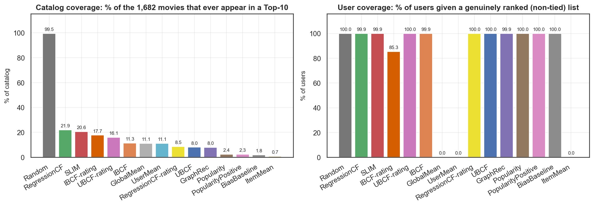

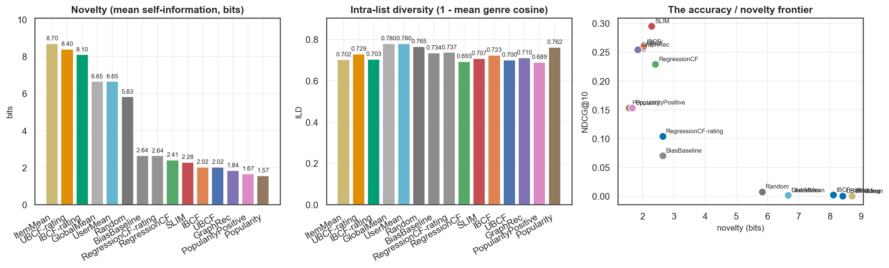

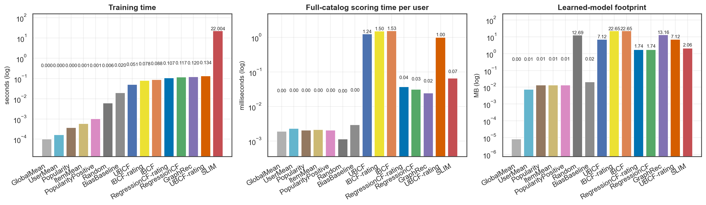

### Rankings by axis (the five paradigms)

| Axis | Metric | Better | Ordering |
|---|---|---|---|
| predictive accuracy | rmse | lower | IBCF (0.9402) > RegressionCF (0.9408) > UBCF (1.0151) > SLIM (1.0331) > GraphRec (1.0725) |
| ranking quality | ndcg_mean | higher | SLIM (0.2950) > IBCF (0.2593) > UBCF (0.2570) > GraphRec (0.2546) > RegressionCF (0.2290) |
| coverage | catalog_coverage | higher | RegressionCF (0.2194) > SLIM (0.2063) > IBCF (0.1130) > UBCF (0.0803) > GraphRec (0.0797) |
| novelty | novelty_mean | higher | RegressionCF (2.4085) > SLIM (2.2827) > IBCF (2.0234) > UBCF (2.0203) > GraphRec (1.8403) |
| diversity | ild_mean | higher | IBCF (0.7231) > GraphRec (0.7104) > SLIM (0.7067) > UBCF (0.6996) > RegressionCF (0.6929) |
| efficiency | total_time_s | lower | GraphRec (0.1429) > RegressionCF (0.1464) > UBCF (1.2202) > IBCF (1.5277) > SLIM (22.0668) |

The five paradigms win on different axes, and the axes are in tension: the measured ordering on ranking quality is nearly the reverse of the ordering on coverage and novelty. Declaring one 'best' requires first declaring which axis the product is optimising.

## 14. Ablation studies

95 controlled ablation rows, each changing exactly one factor. Full table in `results/tables/ablations.csv`; the summary below reports the NDCG@10 spread each factor is responsible for on the validation split.

| Family / factor | Variants | Best (NDCG) | NDCG | Worst (NDCG) | NDCG  | NDCG spread | Best (RMSE) | RMSE | RMSE spread | Discriminates on |
|---|---|---|---|---|---|---|---|---|---|---|
| GraphRec/propagation_depth | 5 | L=3 | 0.1750 | L=1 | 0.0011 | 0.1739 | L=9 | 1.0650 | 0.0606 | ndcg |
| UBCF/ranking_head | 3 | score | 0.1813 | rating | 0.0127 | 0.1687 | affinity | 0.9451 | 0.0632 | ndcg |
| RegressionCF/weights | 9 | learned_ridge_lam=3000 | 0.1484 | learned_OLS | 0.0069 | 0.1416 | learned_ridge_lam=100 | 0.9180 | 0.2897 | ndcg |
| IBCF/similarity | 3 | cosine | 0.1715 | pearson | 0.0661 | 0.1054 | pearson | 0.9323 | 0.0153 | ndcg |
| SLIM/elasticnet_mixing | 6 | l1_ratio=0.05 | 0.2079 | l1_ratio=0.98 | 0.1360 | 0.0719 | l1_ratio=0.02 | 1.0358 | 0.0602 | ndcg |
| SLIM/l1_strength | 9 | l1=0.5 | 0.2081 | l1=50 | 0.1373 | 0.0708 | l1=1 | 1.0357 | 0.0608 | ndcg |
| GraphRec/restart_alpha | 8 | alpha=0.95 | 0.1749 | alpha=0.05 | 0.1196 | 0.0553 | alpha=0.25 | 1.0492 | 0.0214 | ndcg |
| SLIM/implicit_threshold | 5 | tau=4 | 0.2081 | tau=5 | 0.1552 | 0.0529 | tau=5 | 1.0302 | 0.0823 | ndcg |
| UBCF/k | 9 | 300 | 0.1676 | 5 | 0.1184 | 0.0492 | 30 | 0.9404 | 0.0458 | ndcg |
| IBCF/k | 9 | 120 | 0.1715 | 5 | 0.1249 | 0.0466 | 20 | 0.9272 | 0.0376 | ndcg |
| GraphRec/degree_normalisation | 2 | degree | 0.1750 | none | 0.1439 | 0.0311 | none | 1.0560 | 0.0092 | ndcg |
| UBCF/similarity | 2 | cosine | 0.1637 | pearson | 0.1348 | 0.0289 | pearson | 0.9370 | 0.0054 | ndcg |
| SLIM/feature_restriction | 6 | top_m=-1 | 0.2081 | top_m=25 | 0.1848 | 0.0233 | top_m=-1 | 1.0362 | 0.0108 | ndcg |
| GraphRec/attenuation_beta | 4 | beta=0.2 | 0.1743 | beta=0.8 | 0.1531 | 0.0212 | beta=0.8 | 1.0456 | 0.0195 | ndcg |
| SLIM/l2_strength | 5 | l2=200 | 0.2065 | l2=0 | 0.1877 | 0.0188 | l2=200 | 1.0370 | 0.0093 | ndcg |
| UBCF/mean_centering | 2 | False | 0.1813 | True | 0.1637 | 0.0177 | True | 0.9425 | 0.0658 | ndcg |
| RegressionCF/k | 4 | 80 | 0.0741 | 10 | 0.0672 | 0.0069 | 40 | 0.9180 | 0.0055 | ndcg |
| IBCF/centering_axis | 2 | — (tied) | 0.1443 | — (tied) | 0.1443 | 0.0000 | item | 0.9476 | 0.0004 | rmse |
| IBCF/mean_centering | 2 | — (tied) | 0.1715 | — (tied) | 0.1715 | 0.0000 | True | 0.9334 | 0.0916 | rmse |

**2 block(s) show a zero NDCG@10 spread — IBCF/centering_axis, IBCF/mean_centering — and that is a result rather than a bug.** A block with ndcg_tie = true varies a factor that the validation-selected ranking head does not read. The clearest case is IBCF centring: the selected head scores sum(max(sim,0) * 1[liked]), which never touches the centred ratings, so every centring variant produces the identical ordering and only RMSE separates them. The other case is the graph model's attenuation at a single effective path length: when only one odd path length can reach a candidate, beta multiplies every score by the same positive constant and cannot reorder anything, which is why that ablation is measured at the deepest propagation in the sweep instead.

What changed and why, factor by factor:

- **GraphRec/propagation_depth** (NDCG@10 spread 0.1739, best = `L=3`): L=1 reaches only items the user already has (all excluded), so it is a pure floor. L=3 is exactly the collaborative-filtering path u->i'->v->i. Beyond that, each extra pair of hops mixes in evidence from users two steps removed, which adds coverage of popular hubs and dilutes personalisation.

- **UBCF/ranking_head** (NDCG@10 spread 0.1687, best = `score`): 'rating' ranks by rhat and is dominated by thinly-supported items that one enthusiastic neighbour rated 5. 'score' keeps the unnormalised evidence mass. 'affinity' sums positive similarity over neighbours who actually liked the item, which is the implicit-feedback objective and matches the Top-N task.

- **RegressionCF/weights** (NDCG@10 spread 0.1416, best = `learned_ridge_lam=3000`): lambda=0 is ordinary least squares on a design matrix whose column count (k) often exceeds the number of users who rated the target item, so it is under-determined and overfits badly. Growing lambda shrinks the partial coefficients toward zero; as it does, the learned weights converge back toward the marginal similarity ordering, which the measured correlation r(sim,coef) tracks directly.

- **IBCF/similarity** (NDCG@10 spread 0.1054, best = `cosine`): Adjusted cosine removes per-user rating scale before comparing items and is the strongest rating-side similarity. Item-item Pearson conditions on the co-rated users only, which on a sparse catalogue assigns near-perfect correlations to obscure pairs backed by a handful of users -- good for RMSE where those items are rarely queried, disastrous for Top-N where they flood the head of the list.

- **SLIM/elasticnet_mixing** (NDCG@10 spread 0.0719, best = `l1_ratio=0.05`): At fixed total penalty, shifting the mix toward L1 trades density for selectivity: an L1-heavy model keeps few, confident edges; an L2-heavy model keeps many small ones.

- **SLIM/l1_strength** (NDCG@10 spread 0.0708, best = `l1=0.5`): L1 is the sparsity dial. Because W >= 0, the L1 term is linear on the feasible set and its proximal operator is a hard shift: a coefficient survives only if its co-occurrence evidence exceeds lambda_1. Raising it prunes weak item-item edges, shrinking the model and the catalogue it can reach.

- **GraphRec/restart_alpha** (NDCG@10 spread 0.0553, best = `alpha=0.95`): alpha is the restart / attenuation strength. Large alpha keeps the walk near the seed user (local, novel, high coverage); small alpha lets it relax toward the degree-proportional stationary distribution, which is popularity.

- **SLIM/implicit_threshold** (NDCG@10 spread 0.0529, best = `tau=4`): tau decides what counts as an endorsement. Low tau treats a 1-star rating as a positive and pollutes the co-occurrence counts; high tau starves the Gram matrix of support.

- **UBCF/k** (NDCG@10 spread 0.0492, best = `300`): Small k is low-bias / high-variance: a handful of neighbours is noisy. Large k adds weakly-similar neighbours whose votes drag the prediction toward the population mean -- which helps ranking (more evidence, more stable ordering) while flattening the rating curve.

- **IBCF/k** (NDCG@10 spread 0.0466, best = `120`): Item neighbourhoods saturate much earlier than user neighbourhoods: past a few dozen items the extra neighbours are near-zero-similarity and change nothing.

- **GraphRec/degree_normalisation** (NDCG@10 spread 0.0311, best = `degree`): Un-normalised path counting scores an item by how many walks reach it, and a high-degree blockbuster sits on enormously more walks than a niche film. Row-normalising makes every node spread one unit of evidence, which is the built-in popularity de-bias.

- **UBCF/similarity** (NDCG@10 spread 0.0289, best = `cosine`): Cosine on raw rating vectors treats an unrated item as a 0, so it partly encodes profile overlap (co-rating volume) as well as taste agreement. Exact co-rated Pearson removes user rating scale and uses only the co-rated intersection, which sharpens rating prediction but throws away the overlap signal that drives Top-N retrieval.

- **SLIM/feature_restriction** (NDCG@10 spread 0.0233, best = `top_m=-1`): Restricting each column's candidate features to its top-M co-occurring items is the standard way to make SLIM scale. It caps model size and solve time; the question is how much ranking quality it costs.

- **GraphRec/attenuation_beta** (NDCG@10 spread 0.0212, best = `beta=0.2`): beta discounts each hop geometrically. It can only change the ranking when two or more odd path lengths reach the candidate set: at L=3 the length-1 term only touches already-rated items, which are excluded, so the score is beta^3 times a fixed quantity and the ordering is invariant in beta. This row is therefore measured at the deepest propagation in the sweep, where small beta makes the long (popularity-driven) paths negligible and large beta lets them compete with direct evidence.

- **SLIM/l2_strength** (NDCG@10 spread 0.0188, best = `l2=200`): L2 does not create zeros; it spreads weight across correlated duplicates instead of letting one of them take everything, and it makes the problem better conditioned so the solver converges in fewer iterations.

- **UBCF/mean_centering** (NDCG@10 spread 0.0177, best = `False`): Mean-centring subtracts mu_v before aggregating, so a generous rater's 4 and a harsh rater's 4 stop meaning the same thing. It is what makes the rating head competitive; for ranking it can hurt, because the centred numerator rewards items that are *above a neighbour's mean* rather than items with a lot of supporting evidence.

- **RegressionCF/k** (NDCG@10 spread 0.0069, best = `80`): Larger neighbourhoods need proportionally more regularisation: the design matrix gains columns without gaining rows.

- **IBCF/centering_axis** (no effect on ranking; RMSE spread 0.0004, best = `item`): Centring by item mean anchors on 'how good is this movie'; centring by user mean anchors on 'how generous is this user'. Item anchoring wins because item means are estimated from far more observations than the deviation signal they replace.

- **IBCF/mean_centering** (no effect on ranking; RMSE spread 0.0916, best = `True`): Item-mean centring turns the prediction into 'this item's mean plus what this user's history says about the deviation', which is the right decomposition for rating prediction.

## 15. Popularity and long-tail analysis

| Model | Mean pop. | Head % | Medium % | Tail % | Coverage | Novelty | Diversity | Gini | NDCG@10 |
|---|---|---|---|---|---|---|---|---|---|
| Random | 38.3727 | 5.6310 | 14.0085 | 80.3606 | 0.9946 | 5.8258 | 0.7653 | 0.2354 | 0.0079 |
| GlobalMean | 13.7410 | 0.0000 | 0.0424 | 99.9576 | 0.1112 | 6.6490 | 0.7800 | 0.9898 | 0.0015 |
| UserMean | 13.7410 | 0.0000 | 0.0424 | 99.9576 | 0.1112 | 6.6490 | 0.7800 | 0.9898 | 0.0015 |
| ItemMean | 1.3329 | 0.0000 | 0.0000 | 100.0000 | 0.0071 | 8.7021 | 0.7020 | 0.9929 | 0.0003 |
| BiasBaseline | 167.6441 | 59.3319 | 40.2969 | 0.3712 | 0.0184 | 2.6428 | 0.7340 | 0.9925 | 0.0704 |
| Popularity | 321.0540 | 100.0000 | 0.0000 | 0.0000 | 0.0238 | 1.5650 | 0.7619 | 0.9900 | 0.1535 |
| PopularityPositive | 301.3330 | 100.0000 | 0.0000 | 0.0000 | 0.0232 | 1.6663 | 0.6892 | 0.9903 | 0.1536 |
| UBCF | 244.3848 | 91.9406 | 8.0594 | 0.0000 | 0.0803 | 2.0203 | 0.6996 | 0.9704 | 0.2570 |
| UBCF-rating | 2.3112 | 0.0318 | 0.0000 | 99.9682 | 0.1605 | 8.3966 | 0.7291 | 0.9612 | 0.0002 |
| IBCF | 242.4982 | 93.6691 | 6.1930 | 0.1379 | 0.1130 | 2.0234 | 0.7231 | 0.9652 | 0.2593 |
| IBCF-rating | 7.4224 | 1.3150 | 1.7603 | 96.9247 | 0.1772 | 8.1028 | 0.7033 | 0.9763 | 0.0023 |
| RegressionCF | 195.5509 | 74.6554 | 21.0604 | 4.2842 | 0.2194 | 2.4085 | 0.6929 | 0.9373 | 0.2290 |
| RegressionCF-rating | 168.1409 | 59.6925 | 38.3139 | 1.9936 | 0.0850 | 2.6373 | 0.7372 | 0.9861 | 0.1039 |
| SLIM | 211.8459 | 76.1718 | 22.1527 | 1.6755 | 0.2063 | 2.2827 | 0.7067 | 0.9306 | 0.2950 |
| GraphRec | 275.3707 | 93.9343 | 5.8537 | 0.2121 | 0.0797 | 1.8403 | 0.7104 | 0.9790 | 0.2546 |

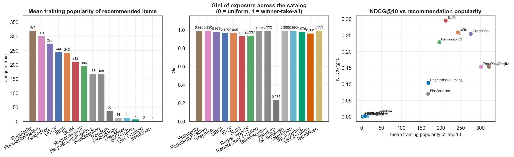


### The exposure gap

The load-bearing number in this section is not a correlation, it is the exposure gap. The 116 head movies are 6.9% of the catalogue and receive 74.7-93.9% of all recommendation slots across the five paradigms. The 1325 long-tail movies are 78.8% of the catalogue and receive 0.0-4.3%. Catalogue coverage across the five spans 8.0%-21.9%: even the widest-reaching model can only ever surface about a fifth of the movies. Every model here is severely popularity-biased; they differ in degree, not in kind.

### Is it a clean accuracy-versus-coverage frontier? No.

Treating NDCG@10, catalogue coverage, novelty and long-tail share as four objectives, the Pareto front over the five paradigms is **RegressionCF, SLIM** — everything else is strictly dominated:

- UBCF is dominated by IBCF, SLIM

- IBCF is dominated by SLIM

- GraphRec is dominated by SLIM

This matters because the textbook framing ('the accurate model is the biased one') is simply not what the data says here. SLIM is both the best ranker *and* better than UBCF, IBCF and the graph model on coverage, novelty and long-tail share simultaneously. Learning item-item weights discriminatively does not buy accuracy at the expense of reach; it buys both, relative to similarity heuristics and to graph propagation.

### Correlations

| Relationship | 5 paradigms (n=5) | ranking-capable (n=8) |
|---|---|---|
| NDCG@10 vs mean popularity | 0.053 | 0.028 |
| NDCG@10 vs head share | -0.063 | 0.273 |
| NDCG@10 vs long-tail share | -0.402 | 0.245 |
| NDCG@10 vs catalogue coverage | 0.059 | 0.711 |
| NDCG@10 vs novelty | -0.065 | -0.098 |
| NDCG@10 vs intra-list diversity | 0.387 | -0.429 |

With n = 5 a correlation coefficient is a description of five points, not evidence. The exposure percentages and the Pareto analysis below are the load-bearing results; the correlations are reported for completeness. Correlations computed over the full model list are excluded deliberately: the rating-tuned arms rank close to randomly (NDCG@10 as low as 0.0002) while covering 99.5% of the catalogue, and including them manufactures a strong apparent accuracy/coverage trade-off that is really just 'a broken ranker touches many items'.

Read honestly, the paradigm-level correlations are weak and the only one with any size is NDCG@10 against long-tail share (-0.402) — and with five points that is one model's position, not a law.

### Does the most accurate model make the most useful recommendations?

**Not straightforwardly -- but the interesting part is that the trade-off is not where the textbook expects it.**

The most accurate model, SLIM, is *not* the most biased one — it draws 76.2% of its slots from the head, less than UBCF, IBCF or the graph model, and reaches 20.6% of the catalogue. So the easy story ('accuracy causes popularity bias') is false on this data.

The genuine trade-off is between the two Pareto-optimal models, and it is worth being blunt about how unattractive it is. RegressionCF buys 1.3 percentage points of catalogue coverage and 2.6 points of long-tail exposure, and pays 22.4% of its NDCG@10 for them. A product team asked to give up a fifth of its ranking quality for three points of tail exposure would decline, and would be right to. The conclusion is not 'pick the other model'; it is that buying reach from the choice of collaborative model is bad value, and a system that needs reach should buy it somewhere else — in a re-ranking stage, an exploration budget, or content features that collaborative filtering structurally cannot supply.

But the more important answer is that *no* model here is doing the job a recommender exists to do. The best long-tail exposure achieved by any of the five is 4.3% of slots, for a group holding 78.8% of the catalogue. Offline ranking metrics reward predicting what the user would have found anyway, and the held-out ground truth is itself drawn from what users already chose to watch, so the evaluation cannot reward discovery even in principle. Accuracy and usefulness come apart — but the gap is between collaborative filtering as a class and the catalogue, far more than between these five models.

## 16. Cold-start analysis

Users are split into tertiles of training-history length: sparse (<= 30 ratings, n = 321), medium (<= 81, n = 312), heavy (n = 310).

NDCG@10 by user-history tertile:

| Model | Sparse | Medium | Heavy |
|---|---|---|---|
| GraphRec | 0.2378 | 0.2000 | 0.3261 |
| IBCF | 0.2547 | 0.1968 | 0.3266 |
| RegressionCF | 0.1848 | 0.1694 | 0.3325 |
| SLIM | 0.2640 | 0.2480 | 0.3728 |
| UBCF | 0.2408 | 0.2068 | 0.3234 |

RMSE by user-history tertile:

| Model | Sparse | Medium | Heavy |
|---|---|---|---|
| GraphRec | 1.1835 | 1.0696 | 1.0587 |
| IBCF | 0.9977 | 0.9472 | 0.9306 |
| RegressionCF | 0.9863 | 0.9490 | 0.9323 |
| SLIM | 1.1237 | 1.0619 | 1.0119 |
| UBCF | 1.0625 | 1.0128 | 1.0097 |

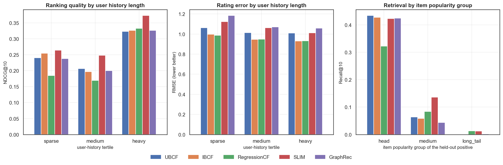

**Read the NDCG table carefully: it is not monotonic in history length, and that is a property of the metric, not of the models.** NDCG@10 normalises by the ideal DCG over `min(K, |G_u|)`, so a user with a single held-out positive scores 1.0 for one hit at rank 1, while a user with ten needs ten hits to do the same. The average number of held-out positives per evaluated user is sparse 3.2, medium 8.2, heavy 23.5, so the three columns are not measuring equally hard problems. The comparison that *is* valid is between models within a column, which is what the questions below use.

RMSE carries no such normalisation, and it behaves as expected: it falls monotonically with history length for 5 of the 5 paradigms (UBCF, IBCF, RegressionCF, SLIM, GraphRec). More history means a better-estimated user, full stop.

**1. Which method is best for sparse users?** SLIM on ranking (NDCG@10 = 0.2640, runner-up IBCF) and RegressionCF on rating error (RMSE = 0.9863).

**2. Which method benefits most from richer histories?** RegressionCF, gaining 0.1477 NDCG@10 from the sparse to the heavy tertile (79.9% relative). Full ordering of absolute gains: RegressionCF +0.1477, SLIM +0.1088, GraphRec +0.0882, UBCF +0.0826, IBCF +0.0719.

**3. Which methods are most sensitive to sparsity?** Ranked by relative NDCG@10 gain from sparse to heavy users: RegressionCF (+79.9%), SLIM (+41.2%), GraphRec (+37.1%), UBCF (+34.3%), IBCF (+28.2%). The least sensitive is IBCF (+0.0719).

### Performance by item popularity group

Ranking quality with the ground truth restricted to one popularity group (the Top-10 list is unchanged; only what counts as a hit changes):

| Model | Head | Medium | Long tail |
|---|---|---|---|
| GraphRec | 0.4244 | 0.0435 | 0.0019 |
| IBCF | 0.4277 | 0.0590 | 0.0015 |
| RegressionCF | 0.3222 | 0.0841 | 0.0130 |
| SLIM | 0.4234 | 0.1362 | 0.0127 |
| UBCF | 0.4339 | 0.0638 | 0.0000 |

Every model retrieves head items far better than tail items. That gap is not a model defect; it is the training signal. The tail has too few interactions for any collaborative method to estimate a reliable neighbourhood, which is precisely why content features or explicit exploration -- not a better CF model -- are the standard fix.

## 17. Explainability

Each model exposes an `explain(u, i)` method that returns the evidence actually used by its own scoring rule:

| Model | Explanation primitive |
|---|---|
| UBCF | the neighbours with the largest signed contribution to the numerator, with their similarity, co-rating count and rating |
| IBCF | the user's own previously-rated movies closest to the candidate, with similarity and contribution |
| RegressionCF | the largest positive and negative *learned* coefficients, shown next to the raw similarity they replaced |
| SLIM | the largest learned item-item coefficients `W[j,i]` from the user's liked items |
| GraphRec | the intermediate movies carrying the most length-3 path weight, with the number of distinct paths |

Worked explanations for the target user's Top-10 are in `results/tables/target_reasoning.csv`, and the three strongest cross-model disagreements are narrated in the next section.

## 18. Target-user recommendations

Target user **643**, derived from roll number `23IM10049`: `roll='23IM10049' -> digits='2310049' -> 2310049 mod 943 = 642 -> +1 -> user_id 643`. Visible profile 101 ratings, 44 hidden from training, 41 in the global test split, 56 held-out positives.

### Top-10 per model

| Model | Rank 1 | Rank 2 | Rank 3 | Rank 4 | Rank 5 | Rank 6 | Rank 7 | Rank 8 | Rank 9 | Rank 10 |
|---|---|---|---|---|---|---|---|---|---|---|
| UBCF | Silence of the Lambs, The (1991) | Shawshank Redemption, The (1994) | Schindler's List (1993) | Princess Bride, The (1987) | Pulp Fiction (1994) | Empire Strikes Back, The (1980) | Monty Python and the Holy Grail (1974) | Blade Runner (1982) | Terminator 2: Judgment Day (1991) | Alien (1979) |
| IBCF | Fugitive, The (1993) | Silence of the Lambs, The (1991) | Pulp Fiction (1994) | Empire Strikes Back, The (1980) | Princess Bride, The (1987) | Indiana Jones and the Last Crusade (1989) | Monty Python and the Holy Grail (1974) | Alien (1979) | Blade Runner (1982) | When Harry Met Sally... (1989) |
| RegressionCF | Empire Strikes Back, The (1980) | 2001: A Space Odyssey (1968) | Apocalypse Now (1979) | Psycho (1960) | Alien (1979) | Fish Called Wanda, A (1988) | Indiana Jones and the Last Crusade (1989) | Willy Wonka and the Chocolate Factory (1971) | Terminator 2: Judgment Day (1991) | Mighty Aphrodite (1995) |
| SLIM | Psycho (1960) | Pulp Fiction (1994) | Silence of the Lambs, The (1991) | GoodFellas (1990) | Sting, The (1973) | Terminator 2: Judgment Day (1991) | Forrest Gump (1994) | Apocalypse Now (1979) | Godfather: Part II, The (1974) | Twelve Monkeys (1995) |
| GraphRec | Silence of the Lambs, The (1991) | Pulp Fiction (1994) | Schindler's List (1993) | Empire Strikes Back, The (1980) | Fugitive, The (1993) | Princess Bride, The (1987) | Twelve Monkeys (1995) | Shawshank Redemption, The (1994) | Contact (1997) | Monty Python and the Holy Grail (1974) |

### Measured on this user's held-out ratings

| Model | RMSE | MAE | P@10 | R@10 | HR@10 | NDCG@10 | MAP@10 | Novelty | Diversity | Tail share |
|---|---|---|---|---|---|---|---|---|---|---|
| UBCF | 0.6700 | 0.5526 | 0.6000 | 0.1071 | 1.0000 | 0.4616 | 0.2877 | 2.0375 | 0.7690 | 0.0000 |
| IBCF | 0.6576 | 0.5382 | 0.7000 | 0.1250 | 1.0000 | 0.5748 | 0.4264 | 1.9835 | 0.7881 | 0.0000 |
| RegressionCF | 0.6516 | 0.5370 | 0.6000 | 0.1071 | 1.0000 | 0.6180 | 0.4148 | 2.3083 | 0.7837 | 0.0000 |
| SLIM | 0.7636 | 0.6392 | 0.5000 | 0.0893 | 1.0000 | 0.5861 | 0.3767 | 2.2365 | 0.7154 | 0.0000 |
| GraphRec | 0.7548 | 0.6426 | 0.5000 | 0.0893 | 1.0000 | 0.4490 | 0.2571 | 1.8694 | 0.6887 | 0.0000 |

Recall@10 looks low for a reason that is arithmetic rather than modelling: this user has 56 held-out positives and only 10 slots, so the attainable maximum is 0.1786. Every model here reaches between 50% and 70% of that ceiling, and all five achieve a hit rate of 1.0 — for a user with a 101-rating profile the Top-10 task is not hard; the interesting question is which movies each one chooses, not whether it finds any.

Per-rank detail for all five lists — popularity, group, whether the slot was a hit, and the user's held-out rating where one exists — is in `results/tables/target_top10_detail.csv`.

### Consensus

15 of 25 distinct recommended movies are picked by more than one model; 7 by three or more.

| Movie | # models | Models | Train popularity | Group | User's held-out rating |
|---|---|---|---|---|---|
| Pulp Fiction (1994) | 4 | UBCF, IBCF, SLIM, GraphRec | 287 | head | 5.0000 |
| Silence of the Lambs, The (1991) | 4 | UBCF, IBCF, SLIM, GraphRec | 275 | head | n/a |
| Empire Strikes Back, The (1980) | 4 | UBCF, IBCF, RegressionCF, GraphRec | 254 | head | 5.0000 |
| Princess Bride, The (1987) | 3 | UBCF, IBCF, GraphRec | 247 | head | 4.0000 |
| Monty Python and the Holy Grail (1974) | 3 | UBCF, IBCF, GraphRec | 218 | head | 5.0000 |
| Alien (1979) | 3 | UBCF, IBCF, RegressionCF | 206 | head | 5.0000 |
| Terminator 2: Judgment Day (1991) | 3 | UBCF, RegressionCF, SLIM | 202 | head | 5.0000 |
| Twelve Monkeys (1995) | 2 | SLIM, GraphRec | 286 | head | 4.0000 |
| Fugitive, The (1993) | 2 | IBCF, GraphRec | 256 | head | n/a |
| Indiana Jones and the Last Crusade (1989) | 2 | IBCF, RegressionCF | 232 | head | 4.0000 |
| Schindler's List (1993) | 2 | UBCF, GraphRec | 227 | head | n/a |
| Blade Runner (1982) | 2 | UBCF, IBCF | 201 | head | 3.0000 |

### Major disagreements

Every recommended movie ranked by how divisively the models treat it is in `results/tables/target_disagreements.csv`; the three most divisive are narrated below.

**Fugitive, The (1993)** — head, 256 training ratings, not in this user's held-out set.

- Recommended by: IBCF, GraphRec; omitted by: UBCF, RegressionCF, SLIM.

- Rank per model: UBCF=—, IBCF=1, RegressionCF=—, SLIM=—, GraphRec=5.

- Score percentile within each model's candidate set: UBCF=99.1%, IBCF=99.9%, RegressionCF=98.7%, SLIM=98.8%, GraphRec=99.7%.

- *IBCF*: most similar movies you already rated: 'Raiders of the Lost Ark (1981)' (you rated 4, sim=+0.545, 147 co-ratings) -> +0.545; 'Seven (Se7en) (1995)' (you rated 4, sim=+0.501, 113 co-ratings) -> +0.501; 'Jaws (1975)' (you rated 4, sim=+0.499, 119 co-ratings) -> +0.499

- *GraphRec*: strongest graph propagation paths: via 'Cape Fear (1962)' (19 length-3 paths, weight 1.37e-04); via 'Strange Days (1995)' (17 length-3 paths, weight 1.34e-04); via 'Raiders of the Lost Ark (1981)' (102 length-3 paths, weight 1.32e-04)


**Psycho (1960)** — head, 166 training ratings, the user actually rated it 5.

- Recommended by: RegressionCF, SLIM; omitted by: UBCF, IBCF, GraphRec.

- Rank per model: UBCF=—, IBCF=—, RegressionCF=4, SLIM=1, GraphRec=—.

- Score percentile within each model's candidate set: UBCF=98.8%, IBCF=98.3%, RegressionCF=99.7%, SLIM=99.9%, GraphRec=98.6%.

- *RegressionCF*: strongest learned regression coefficients: 'Godfather, The (1972)' learned coef=+0.007 (similarity +0.227, you liked it) -> +0.007; 'Clockwork Orange, A (1971)' learned coef=+0.007 (similarity +0.229, you liked it) -> +0.007; 'Jaws (1975)' learned coef=+0.005 (similarity +0.151, you liked it) -> +0.005

- *SLIM*: strongest learned item-item coefficients from your liked items: 'Rear Window (1954)' W=0.0697; 'Treasure of the Sierra Madre, The (1948)' W=0.0642; 'Carrie (1976)' W=0.0608


**2001: A Space Odyssey (1968)** — head, 186 training ratings, not in this user's held-out set.

- Recommended by: RegressionCF; omitted by: UBCF, IBCF, SLIM, GraphRec.

- Rank per model: UBCF=—, IBCF=—, RegressionCF=2, SLIM=—, GraphRec=—.

- Score percentile within each model's candidate set: UBCF=98.1%, IBCF=98.6%, RegressionCF=99.9%, SLIM=96.3%, GraphRec=98.2%.

- *RegressionCF*: strongest learned regression coefficients: 'Clockwork Orange, A (1971)' learned coef=+0.011 (similarity +0.203, you liked it) -> +0.011; 'Star Wars (1977)' learned coef=+0.009 (similarity +0.193, you liked it) -> +0.009; 'Fargo (1996)' learned coef=+0.008 (similarity +0.159, you liked it) -> +0.008


The pattern behind these disagreements is consistent with the aggregate numbers: the models that concentrate on the head of the popularity distribution agree with each other and disagree with the models that reach the tail, and the score percentiles show that the disagreement is usually not 'this model hates the item' but 'this model ranks it 90th percentile instead of 99.9th', which is the whole difference between appearing in a Top-10 and not.

## 19. Error analysis

Best rating model among the paradigms: **IBCF**.

### Regression to the mean

Mean signed error (prediction - truth) by true rating value:

| Model | true = 1 | true = 2 | true = 3 | true = 4 | true = 5 |
|---|---|---|---|---|---|
| GraphRec | 2.327 | 1.387 | 0.466 | -0.420 | -1.322 |
| IBCF | 1.749 | 1.056 | 0.355 | -0.311 | -0.990 |
| RegressionCF | 1.823 | 1.139 | 0.383 | -0.331 | -1.048 |
| SLIM | 2.221 | 1.301 | 0.413 | -0.414 | -1.246 |
| UBCF | 2.010 | 1.202 | 0.412 | -0.361 | -1.154 |

Every model over-predicts low ratings and under-predicts high ones. This is not a bug: squared-error training pulls predictions toward the conditional mean, so the predicted distribution is narrower than the true one. It is also why RMSE and ranking quality come apart -- a model can be well-calibrated in the middle of the scale and still order the extremes badly.

### Error by item popularity

| Model | Head | Medium | Long tail |
|---|---|---|---|
| GraphRec | 1.0238 | 1.0486 | 1.1393 |
| IBCF | 0.9032 | 0.9187 | 0.9945 |
| RegressionCF | 0.9165 | 0.9290 | 0.9748 |
| SLIM | 0.9735 | 1.0045 | 1.1133 |
| UBCF | 0.9579 | 0.9984 | 1.0824 |

### Ranking errors: where does the first hit land?

| Model | Users with a hit | Hit rate | Mean first-hit rank | Median first-hit rank |
|---|---|---|---|---|
| UBCF | 728 | 0.7845 | 3.0577 | 2.0000 |
| IBCF | 722 | 0.7780 | 3.0042 | 2.0000 |
| RegressionCF | 662 | 0.7134 | 3.0574 | 2.0000 |
| SLIM | 758 | 0.8168 | 2.7691 | 2.0000 |
| GraphRec | 721 | 0.7769 | 2.9820 | 2.0000 |

The 20 hardest items to predict (those with at least 10 test ratings, listed in `results/tables/error_hardest_items.csv`) are measurably more *divisive* than the catalogue, not merely more obscure: their full rating distributions have a mean variance of 1.335 against 1.002 for the 603 items with comparable support (>= 50 ratings), and 42.9% of their ratings are at the extremes (1, 2 or 5) against 37.0%. A model trained on squared error predicts a conditional mean, and a conditional mean is exactly the worst summary of a divided audience.

## 20. Limitations

1. **Scale.** Everything here exploits the fact that 943 x 1682 fits in memory: dense similarity matrices, a dense Gram matrix, dense score buffers. The algorithms are correct at any scale but these *implementations* stop being practical somewhere around 10⁴-10⁵ items (SLIM's dense Gram alone would be 80 GB at 10⁵ items).
2. **Single split.** Metrics are from one seeded split; the `*_std` columns are across-user standard deviations, not confidence intervals over repeated splits. Differences smaller than ~0.005 NDCG should not be over-read.
3. **Random rather than temporal holdout.** This measures the missing-value problem, not next-item prediction. A temporal split would give lower numbers and answer a different question.
4. **Offline proxies.** Held-out ratings only exist for items the user already chose to watch, so recall of the long tail is structurally under-measured -- the ground truth is itself popularity-biased. This caps how much any offline study can say about discovery.
5. **Diversity proxy.** Intra-list diversity uses 19 genre flags, which is coarse.
6. **No content or demographic features.** MovieLens ships titles, genres, ages and occupations; none are used except genres for the diversity metric, so the cold-item problem is left unaddressed by design.
7. **Rating heads for implicit models.** SLIM and the graph models are rankers; their RMSE comes from a single least-squares calibration of score to rating and should be read as 'this is not a rating model', not as a competitive RMSE.

## 21. Conclusions

**There is no single winner, and the reason is structural rather than accidental.** SLIM wins ranking (NDCG@10 0.2950), RegressionCF-rating wins rating prediction (RMSE 0.9191; IBCF at 0.9402 is the best among the ranking-selected configurations), RegressionCF wins catalogue coverage (21.9%), RegressionCF wins novelty (2.41 bits) and UBCF is the cheapest to train (0.05 s). Four different models on five axes.

**Personalisation is worth paying for, but the bar is popularity, not zero — and on the rating task the bar is nearly unbeatable.** The popularity baseline reaches NDCG@10 0.1535 with no model at all; SLIM reaches 0.2950, a 92.2% relative gain, so personalisation clearly earns its keep for Top-N. Rating prediction is a different story: a regularised bias model that knows nothing but 'this user is generous, this film is good' reaches RMSE 0.9438, and the best configuration anywhere in this study (RegressionCF-rating) reaches 0.9191 — an improvement of 0.0247, or 2.6%. Five paradigms, 378 neighbourhood configurations, and the whole collaborative apparatus buys about two and a half percent over two bias terms. Reporting RMSE without that baseline would badly overstate what the modelling achieved.

**Learning the weights beats asserting them, but only with regularisation.** The regression model's unregularised arm degrades as the neighbourhood grows, reaching validation RMSE 1.3651 at the largest k — worse than predicting the global mean. Regularised, the same architecture reaches 0.9180 against 0.9212 for identical neighbourhoods weighted by similarity, and its ranking-selected configuration has the widest catalogue reach of any model here (21.9%). The learned coefficients correlate 0.617 with the similarities they replaced, so they are not a different signal — they are the same signal with redundancy removed.

**The popularity problem is a property of the class, not of the accurate model.** All five paradigms draw 74.7-93.9% of their recommendation slots from the 116 head movies, which are 6.9% of the catalogue, and at most 4.3% from the 78.8% that is long tail. What the data does *not* support is the usual story that the accurate model is the biased one: on the four objectives (NDCG, coverage, novelty, tail share) the Pareto front is {RegressionCF, SLIM}, and SLIM strictly dominates UBCF, IBCF and the graph model on all four at once. The real decision is between the two models on the front, and it is bad value: 1.3 points of coverage and 2.6 points of tail exposure for 22.4% of NDCG@10. Reach is not something you should buy by picking a different collaborative model.

**Graph propagation depth is a popularity dial, provably.** corr(path length, head share) = 0.717; the stationary distribution of a random walk on an undirected graph is proportional to degree, so an un-restarted walk *is* a popularity ranker. This is the cleanest example in the study of an algorithm's bias being derivable from its mathematics rather than discovered in its output.

**What I would deploy.** For a catalogue of this shape, SLIM-style item-item scoring for the head of the list: it is the strongest ranker, its model is 93.9% sparse so serving is a sparse lookup, and every recommendation comes with an inspectable coefficient. It is also — unusually — not paid for in beyond-accuracy terms: it dominates UBCF, IBCF and the graph model on coverage, novelty and tail share as well. What it still does not give you is reach: 20.6% of the catalogue. The measurements say that swapping in a different collaborative model is a bad way to fix that, so the second stage should be a re-ranker with an explicit exploration budget or content features — not another CF model. Deploying the accuracy winner alone would quietly shrink the catalogue to a few hundred movies.

## 22. Future work

1. **Matrix factorisation and neural baselines** (BPR-MF, implicit ALS, EASE^R, a light autoencoder) to place these five paradigms on the wider map -- EASE^R in particular is the closed-form limit of SLIM without the non-negativity constraint and would isolate what that constraint buys.
2. **Hybridise for the tail -- but not with another CF model.** The Pareto analysis in Part J shows that trading between collaborative models buys very little reach for a lot of ranking quality. The promising direction is a re-ranking stage over the accurate model's candidates, optimising an exposure-constrained objective directly, with content features supplying the signal collaborative filtering structurally cannot have for rarely-rated items.
3. **Repeated splits and significance testing** -- bootstrap confidence intervals over users and paired tests between models, so small differences become defensible.
4. **Temporal evaluation** to check whether the ordering survives a sequential protocol.
5. **Scalable SLIM**: column-parallel coordinate descent with a co-occurrence candidate cache, which removes the dense-Gram memory wall that limits the current implementation.
6. **Calibrated popularity de-biasing** -- inverse-propensity re-weighting of the training signal, evaluated with the same coverage and novelty instruments used here.

---

## Research questions, answered

**Which method performs best?** It depends on the objective, and the answer changes with it: SLIM on ranking (NDCG@10 0.2950, MAP@10 0.1729), RegressionCF-rating on rating error (RMSE 0.9191), RegressionCF on catalogue coverage (21.9%). The rating winner is a *configuration* as much as a model: the same paradigm tuned for ranking sits at RMSE 0.9408.

**Under what conditions?** SLIM's advantage holds where co-occurrence evidence is dense — users with longer histories and items in the head. For the sparse-history tertile the best ranker is SLIM (0.2640) and the best rating model is RegressionCF (0.9863). When the objective includes discovery, the ordering inverts entirely.

**Why?** Because the models differ in *what evidence they are allowed to use and how much they are allowed to trust it*. SLIM learns item-item weights discriminatively against the reconstruction objective and prunes everything that does not pay for itself, so it concentrates on well-supported co-occurrences. The regression model solves a ridge system per item, which discounts redundant neighbours and lets it stay calibrated on thin evidence — which is why it keeps 4.3% long-tail exposure, the most of any model here. Neighbourhood CF asserts its weights and inherits whatever bias the similarity carries. Graph propagation's bias is the operator's stationary distribution, which is degree — popularity.

**What are the trade-offs?** Three real ones and one that turns out to be a myth. (a) *Rating accuracy versus ranking quality*: RegressionCF-rating has the best RMSE in the study and NDCG@10 0.1039, while SLIM has the best NDCG@10 and RMSE 1.0331. (b) *Reach versus ranking*, but only between the two Pareto-optimal models: RegressionCF buys 1.3 points of coverage and 2.6 points of long-tail exposure for 22.4% of NDCG@10. (c) *Cost*: training spans 0.051 s to 22.0 s and model size 1.74 MB to 22.7 MB. The myth is that accuracy *causes* popularity bias: over the five paradigms corr(NDCG@10, catalogue coverage) = 0.059 and the most accurate model dominates three of the other four on coverage, novelty and tail share simultaneously.

**Which methods favour the long tail?** Ordered by share of Top-10 slots drawn from the long tail: RegressionCF (4.3%), SLIM (1.7%), GraphRec (0.2%), IBCF (0.1%), UBCF (0.0%). The two Pareto-optimal models — RegressionCF and SLIM — are the only two that reach the tail at all in any meaningful sense; the other three are within a fraction of a percentage point of never leaving the head. Read the scale before reading the ordering: the best of them still gives 4.3% of its slots to 78.8% of the catalogue.

**Which methods are more efficient?** Training: UBCF 0.051 s, IBCF 0.088 s, RegressionCF 0.117 s, GraphRec 0.120 s, SLIM 22.004 s. Full-catalogue scoring per user: GraphRec 0.02 ms, RegressionCF 0.03 ms, SLIM 0.07 ms, UBCF 1.24 ms, IBCF 1.53 ms. Model footprint: RegressionCF 1.74 MB, SLIM 2.06 MB, UBCF 7.12 MB, GraphRec 13.16 MB, IBCF 22.65 MB. These are single-run wall-clock times on a shared machine, so treat the sub-second figures as order-of-magnitude; the footprints and the asymptotics in Section 12.1 are the durable numbers. The shape of the answer is robust either way: SLIM costs orders of magnitude more to train than anything else here and is still among the cheapest to *serve*, because its model is a sparse matrix and inference is one sparse row product.

**Which method would you choose for a real system and why?** SLIM as the primary ranker, with a second stage for reach. It is the strongest ranker measured here, its learned matrix is 93.9% sparse (102 neighbours per item on average) so serving is a sparse lookup with no user-side computation, it retrains in 22.0 s on this data, and every slot is explainable by a single coefficient. The caveat is non-negotiable: on its own it reaches 20.6% of the catalogue and draws 1.7% of its slots from the tail. Part J also says *how* to fix that: not by choosing a different collaborative model — the best available swap costs 22.4% of NDCG@10 for 2.6 points of tail exposure — but with an explicit exploration or diversification budget layered on top, sized by exactly those coverage and novelty measurements.

---

*Generated by `src/report.py` from `results/`. 17 figures in `figures/`.*
